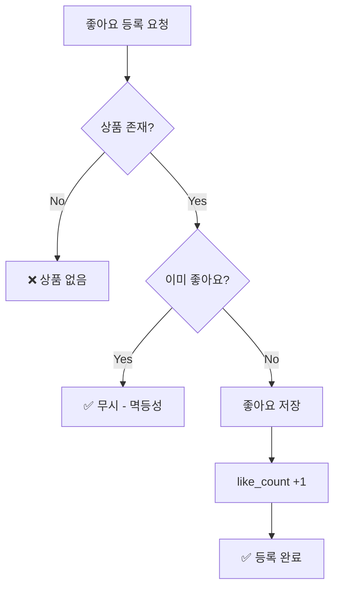
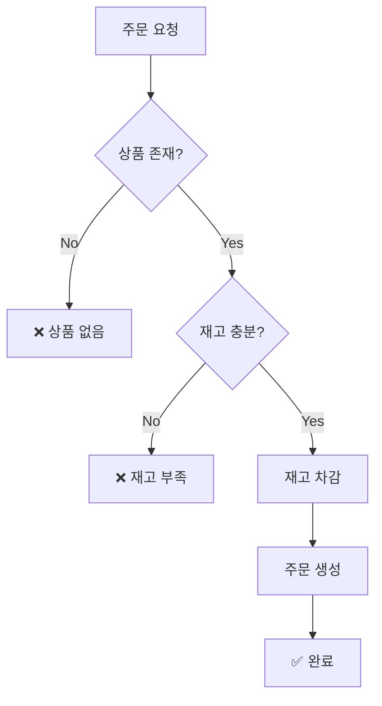
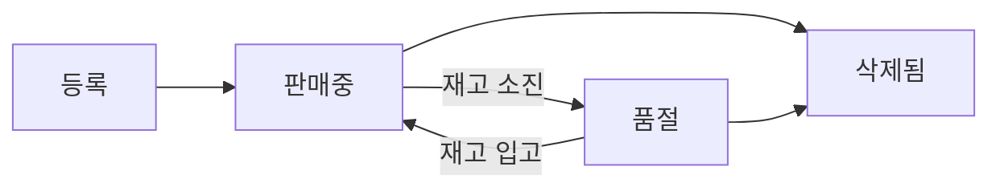
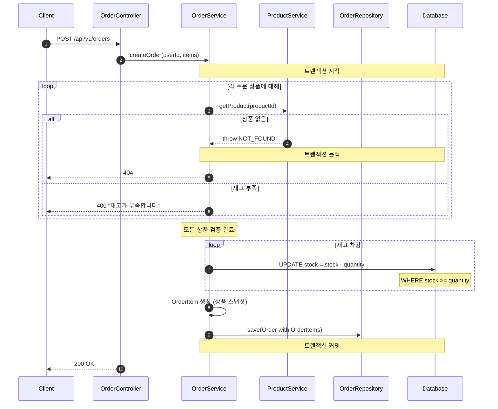
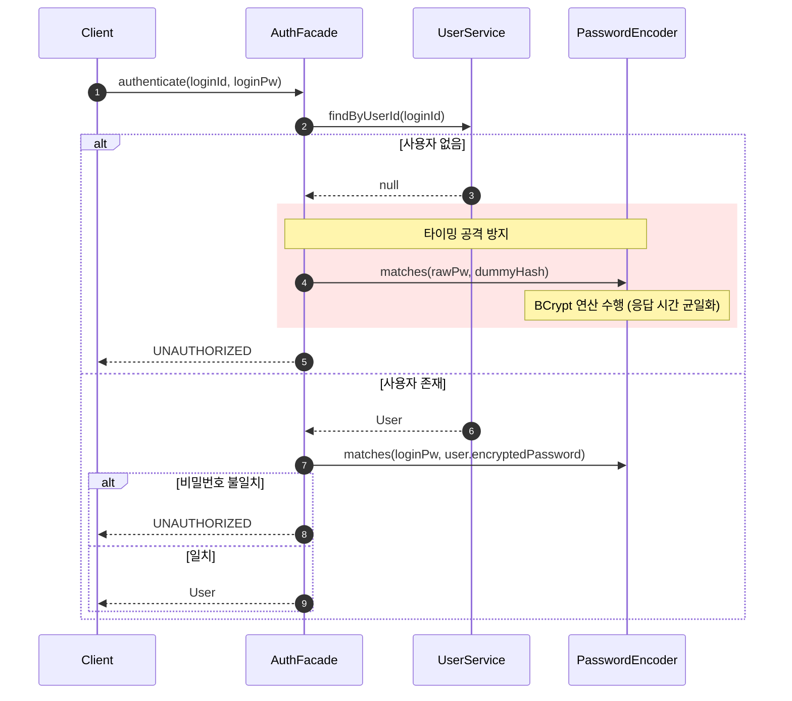
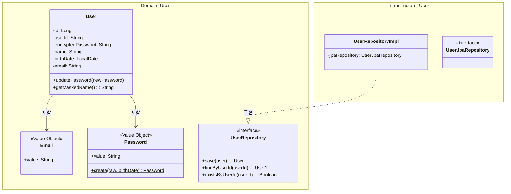
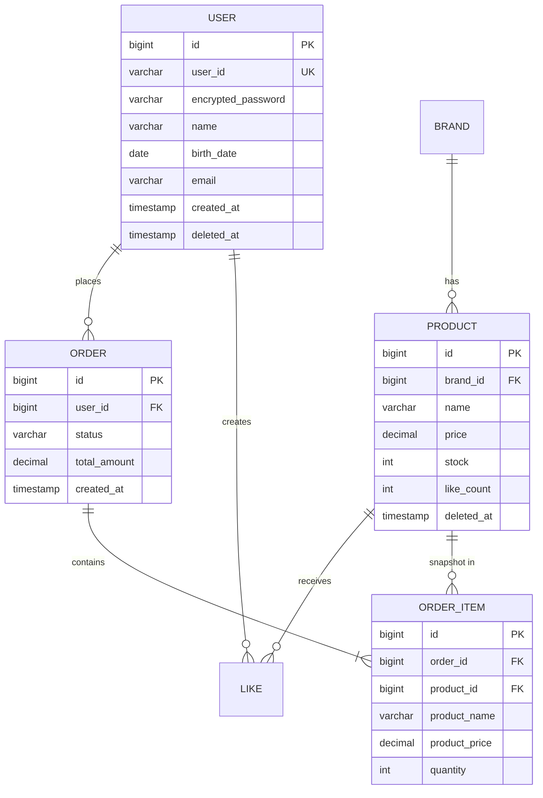
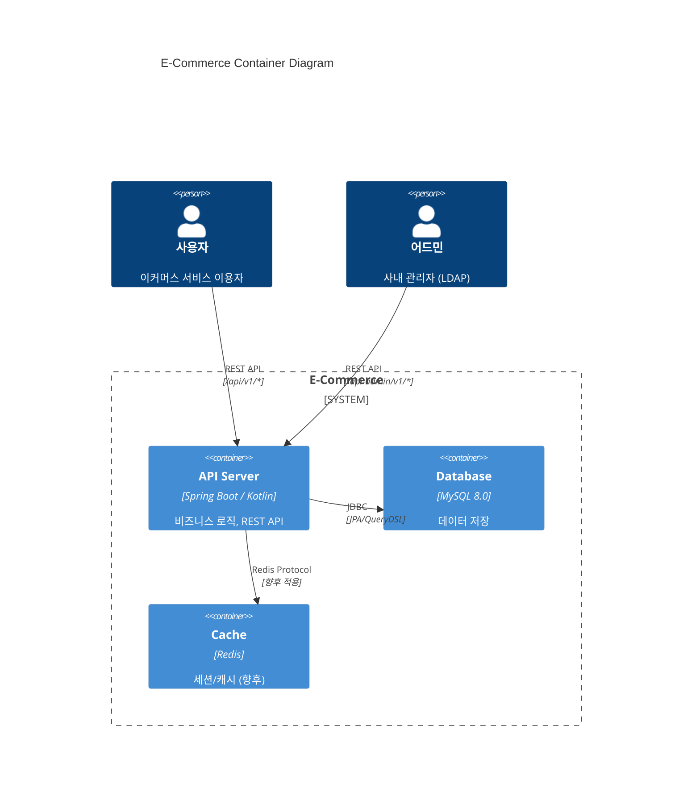

# 무엇을 설명하는가

이번 글은 과제 속 요구사항에 맞는 기술명세서 혹은 설계도를 정의하고 작성하기 위한 과정과 고민, 피드백 그리고 하나의 주관적 해답을 설명한다.

**요구사항 구체화 및 설계 다이어그램 작성** 과정에서 요구사항을 바로 코드로 옮기는 것이 아니라, 요구사항의 모호한 부분을 제거하고, 협업하는 입장에서 필요한 도메인 용어 및 흐름 정리, 시스템 구조와 흐름 시각화를 통한 설계를 진행하고, **실무에서 가장 자주 쓰이는 핵심 다이어그램들** 을 활용해 어떻게 표현할 수 있는지, E-commerce 서비스 설계를 바탕으로 정리한다.

# 왜 작성하는가

독자는 실무에서 요구사항을 얼마나 만나봤는가? PRD? 선과 면으로 그려진 Figma로 그려진 기획서? 아니면.. 약 800 줄 가량의 글자로 이뤄진 야생의 문서?
팀 혹은 회사 배경마다 다르겠지만, 개발자가 전달받은 여러가지 요구사항을 읽고 완벽한 설계를 한번에 명확하게 정의하고 다른 개발자들과 완벽한 협업을 할 수 있을까?

내용과 양을 불문하고 개발자는 요구사항을 받아 해석/정리하고 이를 구현하기에 앞서, 팀원 간 소통을 위한 도메인 정의, 그리고 이를 뒷받침해 줄 여러 도구들.. 개발자가 고려해야 할 **"설계를 위한 요구사항은 없다."**


*노인을 위한 나라는 없다*


# 서론

설계에는 정해진 규칙은 없지만, 보통 팀과 상황에 따라 아래의 흐름에 맞춰 변형되고, 반복적으로 검증된 흐름은 존재한다.

```
요구사항 분석/정의 → 도메인 정의 → 다이어그램 정의
```

**요구사항 분석**은 "무엇을 만드는가"를 확정하는 단계다.

**도메인 정의**는 팀 전체가 같은 단어로 같은 개념을 이야기하도록 정렬하는 단계다.

**다이어그램 정의**는 그 합의된 개념을 시각적으로 검증하는 단계다.

이 순서가 중요한 이유는, 도메인 용어가 정의되지 않은 상태에서 ERD를 그리면 "이 테이블의 `status`가 뭘 의미하지?"라는 질문이 다이어그램을 그린 후에야 나오기 때문이다. 반대로 도메인을 먼저 정의하면, "주문 상태는 PENDING → PAID → SHIPPED → COMPLETED → CANCELLED" 라는 합의가 다이어그램 작성 전에 이미 존재한다.

단, 가장 중요한 건 이 순서는 **한 방향 직선이 아니라 반복(iterate)** 이라는 점이다. 다이어그램을 그리다가 도메인 용어를 수정하고, 구현하다가 다이어그램을 다시 고치는 상황이 반복적으로 발생할 수 있다.

이 글에서는 이번 주차 과제—E-commerce 서비스 설계—를 진행하면서, 이 세 단계를 어떻게 밟았고 어디서 되돌아갔는지를 정리한다.


# 본론


## 1. 도메인 정의: 같은 단어로 말하기

다이어그램을 그리기 전에, 먼저 해야 할 일이 있었다. **팀 전체가 같은 단어로 같은 개념을 이야기하는 것** — Eric Evans가 Domain-Driven Design에서 말한 "Ubiquitous Language(유비쿼터스 언어)"다.

### 1.1 왜 도메인 정의가 먼저인가?

요구사항 원문에는 이런 문장이 있었다:

> "사용자가 여러 브랜드의 상품을 둘러보고, 마음에 드는 상품엔 좋아요를 누르죠."

이 한 줄에서 기획자, 디자이너, 백엔드 개발자, 프론트엔드 개발자가 각각 떠올리는 것이 다르다:
- 기획자: "좋아요 버튼 UI와 인터랙션"
- 프론트: "API 호출 타이밍, 낙관적 업데이트?"
- 백엔드: "Like 테이블? 상품에 likeCount 컬럼? 중복 처리?"

> 도메인 용어가 정의되어 있지 않으면, 상호간 차이로 인해 발생한 오류가 코드 리뷰 혹은 QA 과정 때 비로소 드러난다. 기능은 잘못되었고, 일정은 촉박하다. 그때는 이미 늦다.

### 1.2 용어 매핑: 비즈니스 ↔ 기술

이번 프로젝트에서 정의한 도메인 용어 테이블이다.

| 비즈니스 용어 | 기술 용어 | 정의 |
|--------------|----------|------|
| 회원 | User | 서비스에 가입한 사용자 |
| 어드민 | Admin | LDAP 인증을 통해 관리 기능을 수행하는 내부 직원 |
| 브랜드 | Brand | 상품을 제공하는 업체/브랜드 |
| 상품 | Product | 판매 대상 물품 (브랜드에 속함) |
| 좋아요 | Like | 사용자가 관심 상품에 표시하는 행위 |
| 주문 | Order | 사용자의 상품 구매 요청 |
| 주문상품 | OrderItem | 주문에 포함된 개별 상품 (스냅샷) |
| 재고 | Stock | 상품의 판매 가능 수량 |

단순한 번역 테이블처럼 보이지만, 이 테이블이 없으면 다음과 같은 혼란이 생긴다:
- "좋아요"의 주체는 User인가, 행위 자체인가? → **Like는 독립된 도메인 엔티티** (User-Product M:N 관계의 중간 테이블이 아니라, 자체 생명주기를 가진 개념)
- "주문상품"은 "상품"과 같은 건가? → **OrderItem은 Product의 스냅샷**이다. 가격이 바뀌어도 주문 당시 가격이 보존된다.

### 1.3 액터 정의: 누가 이 시스템을 쓰는가?

도메인 용어 다음으로 정의할 것은 **액터(Actor)** 다. "누가 이 기능을 쓰는가"가 확정되어야 화면, API 설계와 권한 분리가 가능하다.

| 액터 | 인증 방식              | 할 수 있는 것 |
|------|--------------------|-------------|
| 비회원 (Guest) | 없음                 | 회원가입, 상품/브랜드 조회 |
| 회원 (Member) | X-LoginId/Pw       | 내 정보 조회, 좋아요, 주문 |
| 어드민 (Admin) | X-Ldap: site.admin | 브랜드/상품 CRUD, 주문 조회 |

이 정의가 있었기 때문에 사용자 권한에 따른 API prefix 분리(`/api/v1` vs `/api-admin/v1`)와 기능 분리가 자연스럽게 따라왔다.

### 1.4 도메인 관계와 비즈니스 규칙

용어와 액터가 정의되면, 도메인 간의 **관계**와 **핵심 규칙**을 정리한다. 이것이 다이어그램의 입력값이 된다.

| 도메인 | 핵심 규칙 |
|--------|----------|
| User | userId 유일, 비밀번호 8-16자 + 생년월일 불포함, 이메일 형식 |
| Brand | 브랜드명 유일, 삭제 시 소속 상품도 삭제 |
| Product | 반드시 하나의 Brand에 속함, 등록 후 브랜드 변경 불가, price/stock >= 0 |
| Like | (userId, productId) 유일, 멱등성 보장 |
| Order | 최소 1개 상품, 일부 재고 부족 시 전체 실패, 스냅샷 저장 |

이 규칙들은 요구사항 원문에 한 줄로 적혀 있거나, 아예 적혀 있지 않았다. "좋아요를 이미 누른 상품에 다시 누르면?"은 요구사항에 없었고, 도메인을 정의하면서 비로소 질문이 생기고 답을 정했다.

> 도메인 정의는 "요구사항에 있는 것을 정리" 뿐 아니라, "요구사항에 없는 것을 발견"하는 과정이다.


## 2. 다이어그램 도구: UML vs Mermaid

도메인이 정의된 후, 시각화할 도구를 선택해야 했다.

### 2.1 UML 2.5.1: 14가지 다이어그램

UML 2.5.1 표준은 구조(Structure) 7종 + 행위(Behavior) 7종, 총 **14가지** 다이어그램을 정의한다.

| 분류 | 다이어그램 | 목적 | 실무 빈도 |
|------|-----------|------|----------|
| **구조** | Class | 클래스 관계, 속성, 메서드 | ★★★ |
| | Object | 클래스 인스턴스 예시 | ★ |
| | Package | 모듈/패키지 조직 | ★★ |
| | Component | 시스템 컴포넌트 의존 | ★★ |
| | Composite Structure | 객체 내부 구조 | ★ |
| | Deployment | 인프라/배포 구조 | ★★ |
| | Profile | 도메인별 UML 확장 | ★ |
| **행위** | Use Case | 액터-시스템 상호작용 | ★★★ |
| | Activity | 워크플로우, 분기 흐름 | ★★ |
| | State Machine | 상태 전이 | ★★ |
| | **Sequence** | **메시지 호출 순서** | **★★★** |
| | Communication | 객체 간 메시지 (번호 기반) | ★ |
| | Timing | 시간 축 기반 상태 변화 | ★ |
| | Interaction Overview | 상호작용 흐름 제어 | ★ |

14가지 중 실무 혹은 수업에서 **가장 많이 소개되는 5가지**:
1. **Sequence Diagram** — API 호출 흐름, 트랜잭션 경계
2. **Class Diagram** — 도메인 모델, 계층 구조
3. **ERD** (UML 표준은 아니지만 사실상 필수) — 데이터 영속성
4. **Flowchart / Activity Diagram** — 비즈니스 규칙 분기
5. **Use Case / C4 Context** — 시스템 경계, 액터 정의

### 2.2 왜 Mermaid인가?

| 기준 | UML 도구 (Draw.io, Lucidchart) | Mermaid (텍스트 기반) |
|------|-------------------------------|---------------------|
| **버전 관리** | 이미지/XML → Git diff 불가 | 텍스트 → Git diff 가능 |
| **코드와의 거리** | 별도 파일로 분리, 문서 링크 필요 | 마크다운 내 직접 삽입 |
| **수정 비용** | 도구를 열고, 드래그하고, 재배치 | 텍스트 수정 한 줄 |
| **시각적 표현** | 매우 세밀한 레이아웃 가능 | 자동 레이아웃 (제한적) |
| **협업** | "최신 버전이 어디에?" 문제 | PR에서 다이어그램 변경 리뷰 가능 |

이번 프로젝트에서는 **Mermaid**를 선택했다. 핵심 이유는 하나:

> **설계는 한 번에 완성되지 않는다. Agent를 활용한 코드작성과 함께 반복(iterate)되어야 하고, 반복되려면 수정 비용이 낮아야 한다.**

UML 도구의 "예쁜 그림"은 첫 버전 혹은 마지막 버전에는 효과적일 수 있다. 하지만, 요구사항은 바뀔 수 있고, 코드가 달라질 때, Draw.io 파일을 열어 동기화할 수 있을까? Mermaid는 `.md` 파일 안에 살아있기 때문에, 코드 리뷰 때 "이 시퀀스 다이어그램도 같이 수정해주세요" 와 같이 동료 혹은 Agent 에게 요청할 수 있다.

### 2.3 UML 14종 → Mermaid 실무 매핑

UML의 개념적 사고방식은 빌리되, 도구는 Mermaid를 쓴다.

| UML 다이어그램 | Mermaid 대응 | 이 프로젝트 적용 |
|---------------|-------------|----------------|
| Use Case | C4 Context + Flowchart | 액터 정의, 도메인 관계 |
| Activity | Flowchart | 좋아요/주문 비즈니스 규칙 |
| Sequence | Sequence Diagram | 회원가입, 인증, 주문 생성 흐름 |
| Class | Class Diagram | 계층 구조, Aggregate 경계 |
| State Machine | Flowchart | 회원/상품 상태 흐름 |
| Component / Deployment | C4 Container | 배포 단위, 서비스 경계 |
| (비표준) ERD | erDiagram | 테이블 관계, 카디널리티 |


## 3. 다이어그램: 도메인을 시각으로 검증하기

도메인과 도구가 정해진 뒤, 실제로 그리기 시작했다. 각 다이어그램은 **하나의 질문**에 답한다.

```
Flowchart (규칙) → Sequence (흐름) → Class (구조) → ERD (영속성)
```

### 3.1 Flowchart — "이 기능의 규칙은 뭔가?"

**용도**: 비즈니스 로직의 분기점(If-Else)을 직관적으로 설명

**언제 쓰는가**: 요구사항에 "~면 ~하고, 아니면 ~한다" 같은 조건이 있을 때.

요구사항 원문에는 "좋아요 등록"이라는 한 줄만 있었다. 하지만 이 한 줄 뒤에 숨겨진 질문들이 있다: 상품이 없으면? 이미 좋아요한 상품이면? 이런 **숨겨진 분기**를 드러내는 것이 Flowchart의 역할이다.



이 Flowchart를 그리면서 **멱등성(idempotency)**이라는 설계 결정이 자연스럽게 도출할 수 있었다. "이미 좋아요한 상품에 또 요청하면?" → 에러를 전달할지(CONFLICT), 무시할지(200 OK), Flowchart 없이는 이 질문 자체에 도달하지 못했을 것 같다.

주문 생성도 마찬가지. "재고 부족이면 전체 실패? 부분 성공?"이라는 정책 결정은 Flowchart로 표현할 수 있다.



**Flowchart가 답해주는 것**: "이 기능이 실패하는 경우는 몇 가지인가?"

이것은 곧 **테스트 케이스 목록**이 된다. Flowchart의 각 분기(branch)가 곧 테스트해야 할 경로 역할을 갖게된다.

또한 **상태 전이(State Machine)** 도 Flowchart로 충분히 표현할 수 있다. UML에서 별도 다이어그램 유형이지만, Mermaid의 Flowchart 문법으로 간결한 그림이 된다. 상품의 상태를 하나의 그림으로 표현할 수 있다.



### 3.2 Sequence Diagram — "누가 누구에게 무엇을 요청하는가?"

**용도**: 객체 간의 호출 흐름을 시간축 위에 표현

**언제 쓰는가**: API 호출 흐름, 트랜잭션 경계, 에러 분기를 정의할 때.

모든 다이어그램 중 **가장 많이 그렸고, 가장 많이 수정한** ~~**불완전한**~~ 다이어그램이다. Sequence Diagram은 "이론적으로 맞는 구조"가 아니라 "실제로 코드가 실행되는 순서"를 보여주기 때문에 수많은 수정이 이뤄졌다.

주문 생성 흐름에서 트랜잭션 경계와 재고 차감 타이밍을 정의한 예시는 아래와 같다.



이 다이어그램을 그리면서 내린 **핵심 설계 결정**들:
- **검증 우선**: 모든 상품 존재/재고 확인을 먼저 한 뒤에 차감 시작 (부분 차감 후 롤백 방지)
- **전체 실패 정책**: 하나라도 실패하면 전체 트랜잭션 롤백
- **스냅샷 타이밍**: 차감 후, 저장 전에 스냅샷 생성

개인적으로 하나 큰 인사이트를 얻은 작업은 **인증 흐름에서 타이밍 공격 방지**를 시퀀스로 표현한 부분이다.

패스워드 검증(BCrypt)의 응답 시간차를 이용해 **계정 존재 여부**를 추론할 수 있는 취약점을 이론수업 이후 오랜만에 만나볼 수 있었다.

> 보안/안전은 필자에게 있어 생각하는 설계의 방향성 중 구현을 제외하고 1순위로 생각하는 사항이다.



`rect` 블록으로 "이 부분이 왜 있는지" 혹은 특정 기능을 시각적으로 강조할 수 있는 것이 Mermaid Sequence의 강점이다.

**Sequence Diagram이 답해주는 것**: "이 API가 호출되면, 내부적으로 정확히 무슨 일이 일어나는가?"


### 3.3 Class Diagram — "누가 무엇을 책임지는가?"

**용도**: 시스템의 정적 구조와 의존 방향을 정의

**언제 쓰는가**: 계층(Layer) 분리, Aggregate 경계, 인터페이스와 구현의 관계를 보여줄 때.

UML Class Diagram은 원래 매우 상세한 표기법(가시성, 다중성, 스테레오타입 등)을 갖고 있지만, Mermaid에서는 **namespace로 계층을 그룹화**하는 것이 핵심이다. 이번 프로젝트의 Aggregate 경계를 정의한 예시는 아래와 같다.



이 다이어그램 속 설계 결정들:
- **Repository 인터페이스는 Domain에**, 구현은 Infrastructure에 (Dependency Inversion)
- **Value Object(Email, Password)** 는 `<<Value Object>>` 스테레오타입으로 명시 — 불변이며 자가 검증
- **JPA Entity와 Domain Entity 분리** — `UserEntity`(JPA)와 `User`(도메인)가 별도 존재

Class Diagram은 "처음에 한 번 그리고 끝"이 아니라, 코드 구현 후에 **실제 코드와 동기화** 해야 한다. Mermaid가 `.md` 파일에 있기 때문에 PR에서 "코드 변경 + 다이어그램 변경"을 한 커밋으로 수월하게 작업하고 기록할 수 있었다.

**Class Diagram이 답해주는 것**: "이 클래스는 어떤 계층에 속하고, 누구에게 의존하는가?"


### 3.4 ERD — "데이터는 실제로 어떻게 저장되는가?"

**용도**: 테이블 간의 관계와 카디널리티를 정의

**언제 쓰는가**: DB 스키마 설계, 인덱스 전략, 마이그레이션 계획 수립 시.

ERD는 UML 표준 다이어그램이 아니지만, 백엔드 개발에서는 사실상 **가장 실무적인 다이어그램**. Mermaid의 `erDiagram`으로 전체 테이블 관계를 표현한 예시:



이 ERD를 그리면서 내린 **핵심 설계 결정**:

1. **논리적 FK만, 물리적 FK 없음**: ERD에는 관계선을 그리지만, 실제 DB에는 FK 제약을 걸지 않는다. 이유: 원활한 서비스 분리(MSA) 전환 대비, Soft Delete와의 충돌 방지, 마이그레이션 유연성
2. **ORDER_ITEM에 스냅샷 저장**: `product_name`, `product_price`를 별도 저장하여 상품 가격 변경이 기존 주문에 영향을 주지 않도록 스냅샷 개념으로 저장
3. **like_count 비정규화**: `PRODUCT` 테이블에 좋아요 수를 직접 저장하여 매번 COUNT 쿼리를 하지 않도록 분리

> ⚠️ ERD는 **논리적 관계**를 표현. 실제 DB 스키마에서는 FK 제약 없이 애플리케이션 레벨에서 관계를 관리.

**ERD가 답해주는 것**: "이 비즈니스 개념은 DB에서 어떤 모양으로 존재하는가?"


### 3.5 C4 모델: 시스템의 맥락 파악하기

이론적으로 C4 Context는 가장 먼저 그려야 할 다이어그램이다 — 기술적인 세부 사항에 매몰되기 전, 시스템의 경계를 확정짓는 것이 중요하기 때문이다. 하지만 이번 프로젝트에서는 요구사항 문서가 이미 스코프를 명확히 정의했기 때문에, C4는 모든 상세 다이어그램을 그린 뒤 **전체 그림을 정리하는 용도**로 마지막에 활용했다.

C4 모델은 UML의 Use Case + Component + Deployment 다이어그램을 **추상화 수준별로 재정리**할 수 있다.

| C4 레벨 | 대응하는 UML | 보여주는 것 | 관객 |
|---------|------------|-----------|------|
| Context | Use Case Diagram | 시스템 경계, 외부 연동 | 전체 팀, 기획자 |
| Container | Component + Deployment | 배포 단위, 기술 스택 | 개발팀 |
| Component | Package + Class | 내부 모듈 구조 | 해당 서비스 개발자 |
| Code | Class Diagram | 코드 수준 구조 | 구현 담당자 |

Mermaid는 C4Context, C4Container 문법을 지원한다. 이 프로젝트의 Container 레벨 예시:



C4는 코드에 들어가기 전, **"우리가 만드는 서비스의 전체 그림"** 을 정렬하는 데 가장 효과적이다. 특히 "PG사 연동 혹은 배치 서비스는 이번 스코프에 포함인가?" 같은 경계 질문에 답할 수 있는 기준이 될 수 있다.


## 4. 상황별 다이어그램 작성 순서

본론 3에서는 `Flowchart → Sequence → Class → ERD` 순서로 설명했다. 이 순서를 택한 이유는, **동적인 흐름(Sequence)을 먼저 확정해야 정적인 구조(Class, ERD)가 자연스럽게 따라오기 때문이다.**

"주문 생성 시 ProductService에서 재고를 차감한다"는 Sequence가 확정되어야 "OrderService → ProductService 의존"이라는 Class 관계가 나오고, "product 테이블에 stock 컬럼이 필요하다"는 ERD를 도출할 수 있다.

하지만 이 순서가 항상 정답은 아니다. 프로젝트 상황에 따라 시작점이 달라진다.

### 상황별 순서 변형

| 상황 | 순서 변형 | 이유 |
|------|----------|------|
| 시스템 경계가 불명확 | C4 Context를 먼저 | 범위 확정 후 상세화 |
| 기존 DB 스키마 존재 | ERD 분석을 먼저 | 제약 조건 파악 후 설계 |
| 사용자 흐름이 핵심 | Sequence를 먼저 | UX 중심 설계 |
| 데이터 중심 서비스 | ERD → Domain → Sequence | 데이터 모델이 도메인 결정 |


## 5. 되돌아간 지점들: 다이어그램은 "문서"가 아니라 "코드"다

이번 과제에서 가장 크게 느낀 점은, 다이어그램의 가치가 **작성 시점**이 아니라 **수정 시점**에 나타난다는 점이었다. 실제로 되돌아간 사례를 정리한다.

**사례 1: 인증 책임의 분리**
- **원래 설계**: `UserService`에서 비밀번호 암호화까지 담당
- **구현 중 변경**: `AuthFacade`(Application Layer)를 도입하여 인증/암호화 책임을 분리
- **결과**: Sequence Diagram과 Class Diagram을 **같은 PR에서** 수정

이 변경은 Sequence를 그리면서 "인증 흐름에 `UserService`가 너무 많은 일을 하고 있다"는 점이 시각적으로 드러났기 때문에 가능했다. 코드만 보고 있었다면 "일단 동작하니까" 넘어갔을 것이다.

**사례 2: 좋아요 멱등성 정책**
- **원래 설계**: 이미 좋아요한 상품에 다시 요청하면 `409 CONFLICT`
- **Flowchart 작성 중 변경**: 분기를 그리다 보니, 에러를 돌려주는 것보다 **무시(200 OK)**하는 것이 클라이언트 입장에서 자연스럽다는 결론
- **결과**: Flowchart의 분기가 곧 API 스펙이 되었다

**사례 3: ERD의 물리적 FK 제거**
- **원래 설계**: ERD에 그린 관계선을 그대로 물리적 FK로 구현할 계획
- **도메인 규칙 정리 중 변경**: Soft Delete(`deleted_at`)와 물리적 FK가 충돌한다는 점을 발견 — 삭제된 Brand의 Product를 FK가 막아버림
- **결과**: 논리적 FK만 유지, 관계는 애플리케이션 레벨에서 관리

세 사례 모두, **다이어그램을 그리는 과정에서 문제가 드러나고 설계가 수정**되었다. 이 과정에서 나의 생각 정리와 Agent 간 대화는 모두 Mermaid로 진행되었고, Mermaid의 핵심 가치를 느낄 수 있었다. 다이어그램이 코드와 같은 `.md` 파일에 있으니, 코드가 변하면 다이어그램도 함께 변한다. Draw.io 파일이었다면? 아마 "나중에 업데이트하자"고 말하고, 영원히 못하지 않았을까...


# 결론
이번 주차를 통해 깨달은 가장 큰 사실은 **"좋은 설계는 코딩 시간을 줄여주는 것이 아니라, 잘못된 코드를 짜는 시간을 없애준다"** 는 것이다.

실무에서는 UML의 14가지 다이어그램을 전부 그릴 필요는 없다고 생각하지만, 경험과 학습을 위해 써보고 싶은 목표가 생겼다. Draw.io 같은 도구로 직접 그린 다이어그램은 나 개인의 자산이 될 수 있다. 하지만 **텍스트 기반으로 관리할 수 있는 Mermaid** 는 관리가 용이하기에, 개인을 넘어 팀 전체의 자산이자 소통 방식이 될 수 있다는 점에서, 현대 개발 환경에서 최선의 선택이라 생각할 수 있었다.

정리하면:

| 질문 | 다이어그램 | Mermaid 문법 |
|------|-----------|-------------|
| "이 기능의 규칙은?" | Flowchart | `flowchart TD` |
| "API가 호출되면 무슨 일이?" | Sequence Diagram | `sequenceDiagram` |
| "누가 무엇을 책임지는가?" | Class Diagram | `classDiagram` |
| "데이터는 어떻게 저장되는가?" | ERD | `erDiagram` |
| "시스템의 전체 그림은?" | C4 Context/Container | `C4Context` / `C4Container` |

다이어그램은 예쁘게 그리기 위한 그림이 아니라, 팀원(또는 미래의 나)과 생각을 동기화하기 위한 언어라고 생각하자.
Mermaid를 통해 문서와 설계를 코드의 영역으로 끌어들임으로써, 요구사항의 모호함을 확신으로 바꿀 수 있는 도구다.


이 글에서 한가지만 강조하자면, 시스템 설계와 요구사항, 다이어그램 등 그 무엇보다 중요한건, **이 모두를 설계하는 우리가 생각할 수 있는 힘이다.**

---

> Reference
>
> - https://www.omg.org/spec/UML/2.5.1/PDF
> - https://www.drawio.com/blog/uml-overview