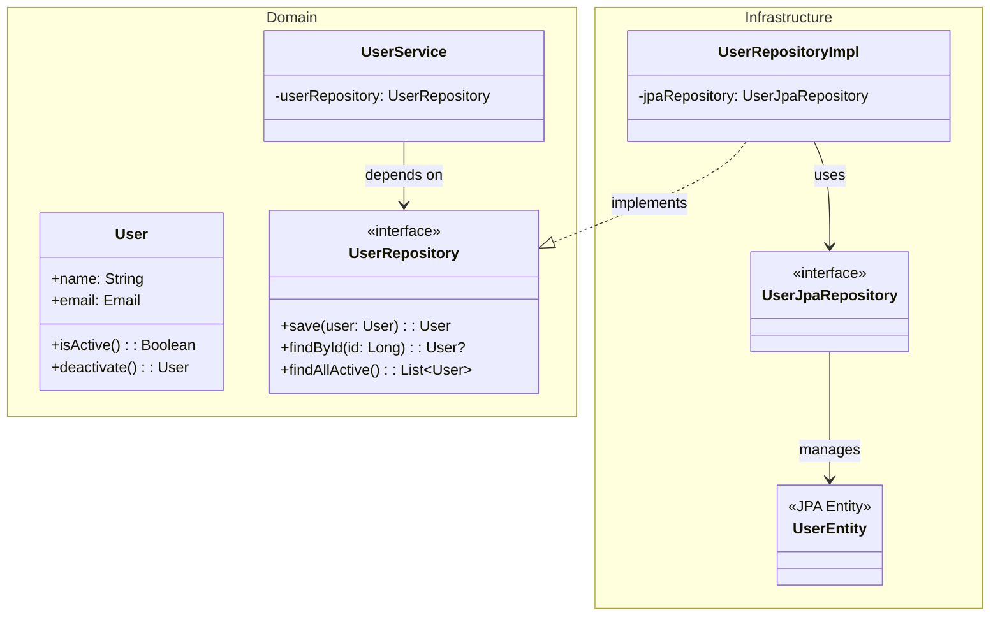
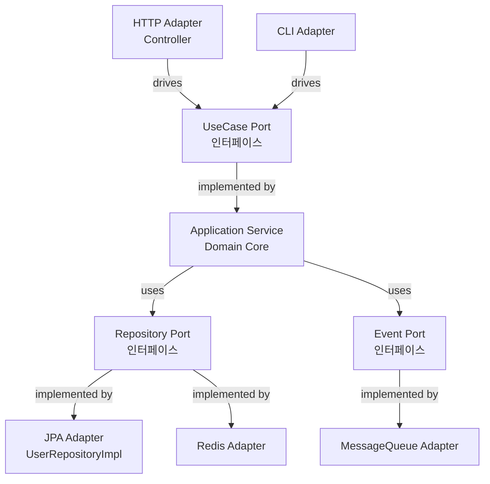

# 무엇을 설명하는가

DIP(Dependency Inversion Principle, 의존성 역전 원칙)가 레이어드 아키텍처에서 어떻게 작동하는지, 그리고 그 원칙을 일관되게 적용하면 어떻게 헥사고날 아키텍처가 탄생하는지를 설명한다.

Django, Ruby on Rails의 Active Record 패턴으로 시작한 개발 경험이 왜 "도메인과 인프라의 분리"라는 집착으로 이어졌는지, 그리고 이 구조적 선택의 트레이드오프를 솔직하게 다룬다.


# 왜 작성하는가

"기간이 2주밖에 없는데, 도메인 객체 따로 JPA 엔티티 따로 만드는 게 말이 돼요?"

맞는 말이다. 그리고 그 선택은 빠르게 동작하는 코드를 만든다. 하지만 3개월 후 그 코드를 다시 열었을 때, `@Entity` 어노테이션이 붙은 클래스에 비즈니스 로직이 가득하고, `findByUserIdAndStatusAndDeletedAtIsNull(...)` 같은 JPA 쿼리 메서드가 서비스 계층에 직접 노출되어 있다면?

Django의 ORM, Rails의 ActiveRecord — 나는 이 프레임워크들의 "마법"으로 개발을 시작했다. 모델이 곧 테이블이고, 테이블이 곧 비즈니스 객체다. 처음에는 생산적이었다. 하지만 서비스가 커지면서 `User.objects.filter(is_active=True, created_at__gte=...)` 가 View에 등장하는 순간, 뭔가 잘못되었다는 걸 느꼈다.

**DIP는 그 "잘못됨"에 이름을 붙여주는 원칙이다.**

한편, 오늘날 강력한 동료인 AI와 함께 개발하는 시대에 "코드를 많이 작성하는 것"은 더 이상 부담이 아니다. PRD와 설계가 명확하다면, 보일러플레이트는 AI가 채운다. 오히려 **명확하고, 견고하고, 확장 가능한 구조를 설계하는 능력**이 개발자에게 더 요구되는 덕목이 되었다.


# 서론

## DIP란 무엇인가

SOLID의 D, Dependency Inversion Principle. 로버트 마틴(Robert C. Martin)이 정의한 두 가지 규칙이다:

> 1. 고수준 모듈은 저수준 모듈에 의존해서는 안 된다. 둘 다 추상화에 의존해야 한다.
> 2. 추상화는 세부 사항에 의존해서는 안 된다. 세부 사항이 추상화에 의존해야 한다.

풀어서 말하면:

- **고수준 모듈**: 비즈니스 로직, 도메인 규칙 — "무엇을 할 것인가"를 정의하는 곳
- **저수준 모듈**: DB 쿼리, HTTP 호출, 파일 I/O — "어떻게 할 것인가"를 구현하는 곳
- **추상화**: 인터페이스, 추상 클래스

즉, **비즈니스 로직이 DB 구현에 의존하지 말고, DB 구현이 비즈니스 로직의 인터페이스에 의존하라**는 것이다.

## 전통적인 레이어드 아키텍처

```
┌─────────────────────┐
│  Presentation Layer │  (Controller, API)
└──────────┬──────────┘
           │ depends on ↓
┌──────────▼──────────┐
│  Application Layer  │  (Service)
└──────────┬──────────┘
           │ depends on ↓
┌──────────▼──────────┐
│    Domain Layer     │  (Entity, Domain Logic)
└──────────┬──────────┘
           │ depends on ↓
┌──────────▼──────────┐
│ Infrastructure Layer│  (Repository, JPA, DB)
└─────────────────────┘
```

위에서 아래로 의존. 직관적이고 단순하다. 그리고 **대부분의 Spring 프로젝트가 이 구조로 시작한다.**

그런데 현실은 어떤가?

```kotlin
// 흔히 볼 수 있는 "레이어드" 서비스
@Service
class UserService(
    private val userRepository: UserJpaRepository // ← JPA Repository 직접 의존
) {
    fun getActiveUsers(): List<UserEntity> {
        return userRepository.findAllByDeletedAtIsNullAndStatus(UserStatus.ACTIVE)
    }
}

@Entity
@Table(name = "users")
class UserEntity( // ← JPA 어노테이션과 도메인이 섞임
    @Id @GeneratedValue
    val id: Long = 0,
    val name: String,
    @Enumerated(EnumType.STRING)
    val status: UserStatus,
    val deletedAt: LocalDateTime? = null
) {
    // 비즈니스 로직이 여기 들어가기 시작한다
    fun isActive() = deletedAt == null && status == UserStatus.ACTIVE
}
```

`@Entity`, `@Table`, `@Column` — 이것들은 JPA의 어노테이션이다. **도메인 객체가 JPA 없이는 존재할 수 없게 되었다.** 도메인 계층이 인프라(JPA)에 오염된 것이다.


# 본론

## 1. 레거시의 실체: Active Record와 레이어 오염

Django와 Ruby on Rails로 개발을 시작하면 **Active Record 패턴**을 자연스럽게 습득한다.

Active Record는 단순하다: **모델 객체가 DB 테이블의 행(row)을 직접 표현하고, 저장/조회/삭제 메서드를 스스로 가진다.**

```python
# Django
class User(models.Model):
    name = models.CharField(max_length=100)
    email = models.EmailField(unique=True)
    is_active = models.BooleanField(default=True)

    def deactivate(self):
        self.is_active = False
        self.save()  # ← 모델이 직접 DB에 저장

# View에서 바로 쿼리
def get_users(request):
    users = User.objects.filter(is_active=True).order_by('-created_at')
```

```ruby
# Ruby on Rails
class User < ApplicationRecord
  validates :email, uniqueness: true

  def deactivate!
    update!(is_active: false)  # ← 모델이 직접 DB를 조작
  end
end

# Controller에서 바로 쿼리
def index
  @users = User.where(is_active: true).order(created_at: :desc)
end
```

처음에는 **엄청나게 생산적**이다. 모델 하나 정의하면 테이블도 생기고, 쿼리도 날리고, 검증도 된다. 스타트업의 빠른 개발에는 더할 나위 없다.

**그런데 서비스가 커지면:**

- View/Controller에 쿼리 로직이 흩어진다
- 모델에 비즈니스 로직과 DB 로직이 뒤섞인다
- "이 로직, DB를 Redis로 바꾸면 어떻게 되지?" → 전체를 뜯어고쳐야 한다
- 테스트를 위해 항상 DB가 필요하다

이것이 내가 **레이어 오염(Layer Pollution)** 이라 부르는 현상이다. 계층의 경계가 흐려지고, 관심사가 뒤섞이기 시작한다.

> Active Record는 나쁜 패턴이 아니다. 다만, 그것이 최선인 **규모**와 상황이 있다. 그 규모를 넘어서는 순간, 우리는 다른 무언가가 필요하다.


## 2. DIP 적용: 의존성의 방향을 뒤집는다

전통적인 레이어드 아키텍처에서 도메인이 인프라에 의존하는 문제를 DIP로 해결하면 어떻게 되는가?

**핵심은 인터페이스의 위치다.**

```
Before (DIP 미적용):
Domain Layer → Infrastructure Layer (JPA, DB)

After (DIP 적용):
Domain Layer ← Infrastructure Layer
      ↑
  <<interface>>
  Repository
```

도메인 계층에 **Repository 인터페이스**를 정의한다. 인프라 계층이 그 인터페이스를 구현한다. 의존성의 방향이 역전된다.

```kotlin
// Domain Layer: 인터페이스 정의
interface UserRepository {
    fun save(user: User): User
    fun findById(id: Long): User?
    fun findAllActive(): List<User>
}

// Domain Layer: 순수한 도메인 객체 (JPA 없음)
data class User(
    val id: Long = 0,
    val name: String,
    val email: Email,
    val status: UserStatus = UserStatus.ACTIVE,
    val deletedAt: LocalDateTime? = null
) {
    fun isActive() = deletedAt == null && status == UserStatus.ACTIVE
    fun deactivate() = copy(deletedAt = LocalDateTime.now())
}

// Infrastructure Layer: 인터페이스 구현
@Repository
class UserRepositoryImpl(
    private val jpaRepository: UserJpaRepository
) : UserRepository {

    override fun save(user: User): User =
        jpaRepository.save(user.toEntity()).toDomain()

    override fun findById(id: Long): User? =
        jpaRepository.findById(id).orElse(null)?.toDomain()

    override fun findAllActive(): List<User> =
        jpaRepository.findAllByDeletedAtIsNullAndStatus(UserStatus.ACTIVE)
            .map { it.toDomain() }
}

// Infrastructure Layer: JPA Entity (인프라의 관심사)
@Entity
@Table(name = "users")
class UserEntity(
    @Id @GeneratedValue val id: Long = 0,
    val name: String,
    @Enumerated(EnumType.STRING) val status: UserStatus,
    val deletedAt: LocalDateTime? = null
)
```

이제 `User` 도메인 객체는 JPA를 모른다. `UserService`는 `UserRepository` 인터페이스에만 의존한다. JPA가 MyBatis로 바뀌어도, Redis로 바뀌어도, 도메인 계층은 변하지 않는다.




## 3. 레이어드를 접으면 헥사고날이 된다

여기서 흥미로운 관점을 제안한다.

DIP를 레이어드 아키텍처에 **일관되게** 적용하면 어떤 구조가 만들어지는가?

```
레거시 레이어드 (의존성 흐름):
Presentation → Application → Domain → Infrastructure

DIP 적용 (의존성 역전):
Presentation → Application → Domain ← Infrastructure
```

그런데, Presentation도 Domain을 오염시키지 않으려면? Presentation도 Domain의 인터페이스(UseCase Port)에 의존해야 한다.

```
Presentation → [UseCase Port] ← Application → Domain ← [Repository Port] ← Infrastructure
```

이 구조를 **"안쪽으로 접으면"** 어떻게 되는가?

```
         [HTTP Adapter]       [CLI Adapter]
                  \               /
           [Driving Port / UseCase Interface]
                        |
                  [Domain Core]
                        |
           [Driven Port / Repository Interface]
                  /               \
         [JPA Adapter]        [Redis Adapter]
```

양쪽에서 도메인을 향해 의존성이 흘러든다. 그리고 이 "포트들"을 6개의 면으로 펼치면:

```
           [HTTP]     [gRPC]     [CLI]
                \        |        /
                 \       |       /
              [Driving Ports (입력 포트)]
                         |
                   [Domain Core]
                         |
              [Driven Ports (출력 포트)]
                 /       |       \
                /        |        \
           [JPA]      [Redis]  [EventBus]
```

**이것이 헥사고날 아키텍처(Ports and Adapters 패턴)다.**

Alistair Cockburn이 제안한 이 아키텍처의 핵심: **도메인 코어는 외부 세계를 모른다. 외부 세계(HTTP, DB, 메시지 큐)가 도메인의 인터페이스(Port)에 맞춰 어댑터를 제공한다.**



레이어드 아키텍처에서 DIP를 **모든 경계에** 적용하고 안쪽으로 접으면 헥사고날이 된다. 두 아키텍처는 별개의 개념이 아니라, 같은 원칙의 서로 다른 표현 방식이다.


## 4. 트레이드오프: 어느 쪽을 선택할 것인가

모든 프로젝트가 헥사고날 아키텍처를 필요로 하지는 않는다. 트레이드오프를 솔직하게 얘기하자.

### 케이스 A: JPA Entity = Domain Entity (혼합형)

```kotlin
@Entity
@Table(name = "users")
class User(
    @Id @GeneratedValue val id: Long = 0,
    val name: String,
    @Enumerated(EnumType.STRING) val status: UserStatus = UserStatus.ACTIVE
) {
    fun deactivate() { /* 비즈니스 로직 */ }
}

@Repository
interface UserRepository : JpaRepository<User, Long> {
    fun findAllByStatus(status: UserStatus): List<User>
}
```

**장점:**
- 코드 양이 절반 이하
- 빠른 프로토타이핑
- 팀 온보딩 비용 낮음
- 작은 서비스에서는 실질적인 문제가 없음

**단점:**
- DB 스키마 변경이 도메인 변경을 강제
- 테스트 시 항상 JPA 컨텍스트 필요 — Fake 구현체를 만들 수 없다
- 도메인 로직이 JPA 제약에 묶임 (`val` → `var` 강제 등)
- 나중에 분리하려면 대규모 리팩토링 필요

### 케이스 B: Domain Entity와 JPA Entity 분리

```kotlin
// 도메인 (JPA 모름)
data class User(
    val id: Long = 0,
    val name: String,
    val email: Email,
    val status: UserStatus = UserStatus.ACTIVE
)

// 인프라 (도메인과 JPA의 중간 번역자)
@Entity
@Table(name = "users")
class UserEntity(
    @Id @GeneratedValue val id: Long = 0,
    val name: String,
    @Enumerated(EnumType.STRING) val status: UserStatus
)

fun UserEntity.toDomain(): User = User(id, name, Email(email), status)
fun User.toEntity(): UserEntity = UserEntity(id, name, email.value, status)
```

**장점:**
- 도메인이 인프라에서 독립
- JPA 없이도 단위 테스트 가능 → Fake Repository 사용 가능
- DB 변경이 도메인에 영향 없음
- 도메인 규칙을 JPA 제약 없이 자유롭게 표현 가능

**단점:**
- 코드량 증가 (Entity, Domain 객체, 변환 함수)
- 팀 전체가 이 패턴에 익숙해야 함
- 간단한 CRUD 서비스에는 과한 구조일 수 있음

### 어느 쪽을 선택할 것인가?

| 상황 | 추천 |
|------|------|
| MVP, 촉박한 데드라인 | 혼합형 (케이스 A) |
| 팀 규모 1~2인, 단기 프로젝트 | 혼합형 (케이스 A) |
| 도메인 규칙이 복잡한 서비스 | 분리형 (케이스 B) |
| 장기 운영 서비스 | 분리형 (케이스 B) |
| DB 교체 가능성이 있는 서비스 | 분리형 (케이스 B) |
| MSA 전환 계획이 있는 서비스 | 분리형 (케이스 B) |

> 결국 트레이드오프다. "항상 분리형이 옳다"도, "항상 혼합형이 실용적이다"도 아니다. 중요한 건 **선택의 이유를 알고 있는 것**이다.


## 5. AI 시대의 구조적 설계

솔직하게 털어놓겠다.

"코드를 많이 써야 해서 분리형이 부담스럽다"는 주장은, 오늘날 많이 약해졌다.

과거에 내가 분리형 구조를 포기했던 이유는 단순했다:
- 도메인 하나 → Domain 클래스 + JPA Entity + 변환 함수
- 10개 도메인이면, 30개 파일을 혼자 타이핑해야 했다

하지만 지금은 다르다. 명확한 요구사항과 설계가 있다면, AI는 보일러플레이트 코드를 순식간에 작성한다. [이전 글에서 다뤘던 Mermaid 다이어그램](/20260213_requirements_for_design)처럼, 클래스 다이어그램 하나를 보여주면 AI는 그에 맞는 코드 구조를 만들어낸다.

즉, **"코드가 많아지는 것"은 더 이상 구조적 선택을 포기할 이유가 되지 않는다.**

오히려 지금 개발자에게 필요한 역량은:
- "이 클래스는 어느 계층에 속하는가?" 를 판단하는 감각
- "이 의존성의 방향은 올바른가?" 를 질문하는 습관
- "나중에 이 코드를 바꾸려면 어디를 건드려야 하는가?" 를 예상하는 능력

코드는 AI가 작성할 수 있다. **구조는 개발자가 설계해야 한다.**

[테스트 글](/20260206_test_double)에서 언급했듯, Fake Repository나 In-memory 구현이 가능한 것 자체가 DIP가 제대로 적용되었다는 증거다. 인터페이스에 의존하지 않으면, 테스트를 위한 대체 구현이 존재할 수 없다.

```kotlin
// DIP가 적용되어야만 이런 Fake가 가능하다
class FakeUserRepository : UserRepository {
    private val store = mutableMapOf<Long, User>()
    private var sequence = 1L

    override fun save(user: User): User {
        val saved = if (user.id == 0L) user.copy(id = sequence++) else user
        store[saved.id] = saved
        return saved
    }

    override fun findById(id: Long): User? = store[id]
    override fun findAllActive(): List<User> = store.values.filter { it.isActive() }
}
```

JPA Entity와 도메인이 섞인 구조에서는 이 Fake가 불가능하다. JPA의 생명주기, 연관관계, 프록시 객체까지 전부 흉내 내야 하기 때문이다.


# 결론

DIP는 단순한 원칙처럼 보이지만, 레이어드 아키텍처에 일관되게 적용하면 아키텍처 전체가 바뀐다. 그리고 그 변화의 끝에는 헥사고날 아키텍처가 있다.

Django와 Rails의 Active Record 패턴에서 시작해, 레이어 오염이 무엇인지 몸으로 배웠다. "왜 서비스 코드에 ORM 쿼리가 있지?", "왜 도메인 객체가 `save()`를 호출하지?", "왜 테스트에 DB가 필요하지?" — 이 질문들이 결국 DIP로 이어졌다.

정리하면:

| 질문 | 답 |
|------|----|
| DIP란? | 고수준(도메인)이 저수준(인프라)에 의존하지 말고, 추상화(인터페이스)에 의존하라 |
| 레이어드 → 헥사고날? | DIP를 모든 경계에 적용하고 안쪽으로 접으면 헥사고날 |
| JPA 혼합 vs 분리? | 트레이드오프 — 하지만 선택의 이유를 알아야 한다 |
| AI 시대에는? | 코드량이 문제가 아니다. 구조를 설계하는 감각이 더 중요해진다 |

마지막으로 한마디.

**DIP는 규칙이 아니라 질문이다.** "이 의존성의 방향이 올바른가?" 라는 질문을 코드를 작성할 때마다 던지는 것. 그 습관이 쌓이면, 어느 순간 코드가 예술처럼 보이기 시작한다.

---

> Reference
>
> - Robert C. Martin, "Clean Architecture" (2017)
> - Alistair Cockburn, "Hexagonal Architecture" (2005) - https://alistair.cockburn.us/hexagonal-architecture/

