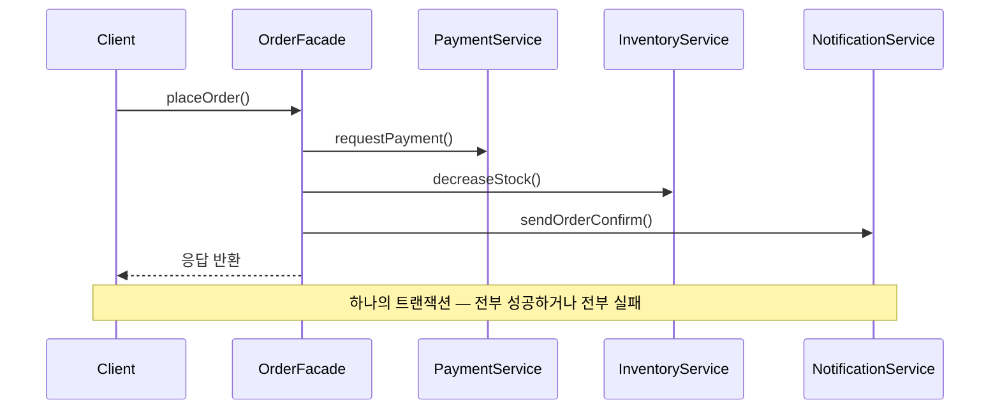
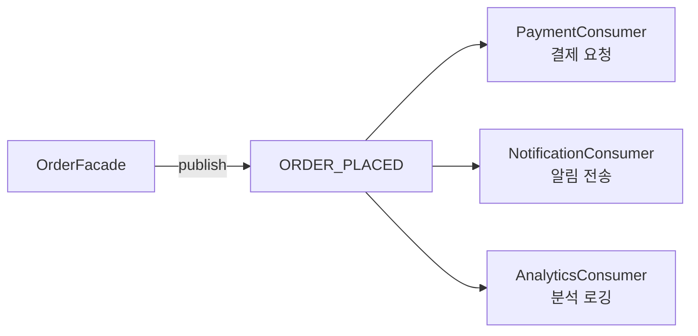
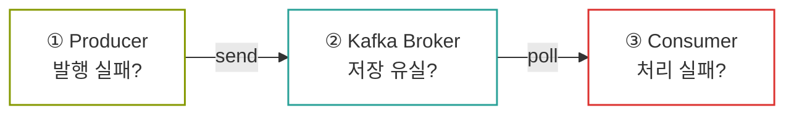
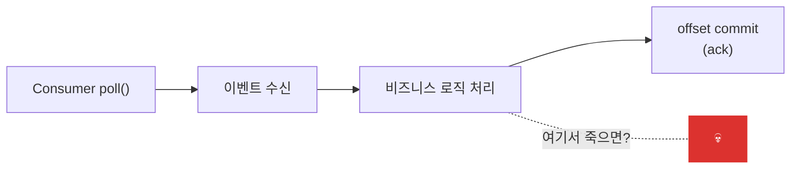
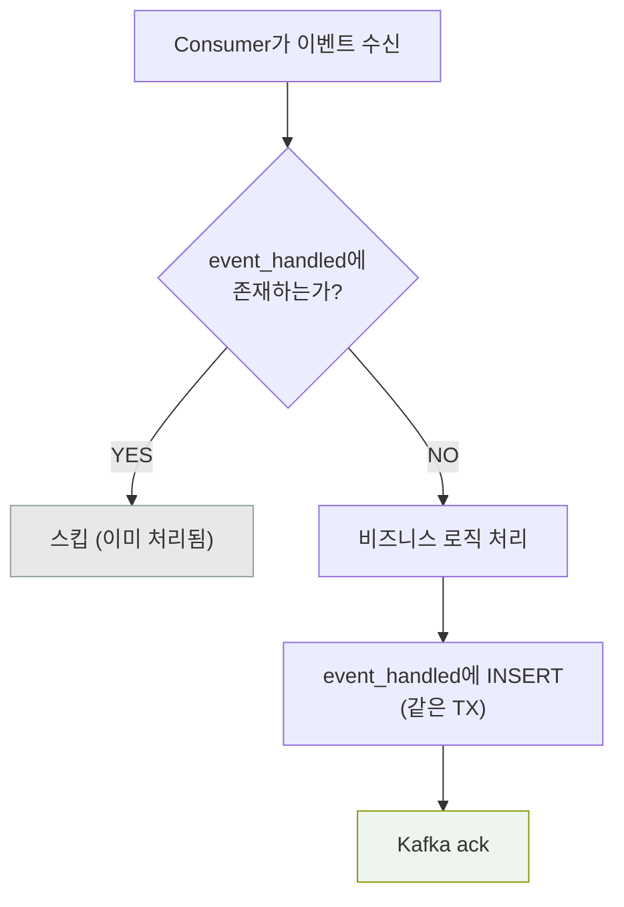
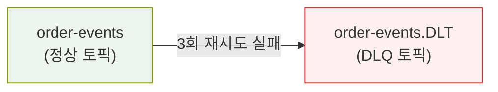
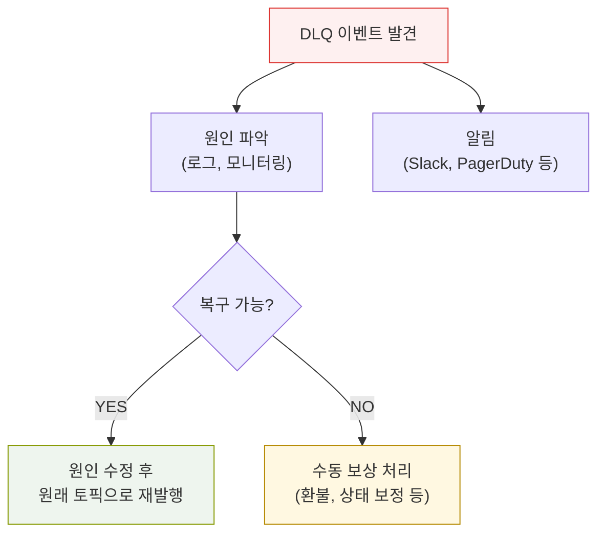

# 무엇을 설명하는가

Apache Kafka를 활용한 이벤트 기반 아키텍처(EDA)의 핵심 개념과, 동기 방식에서 비동기 이벤트 방식으로 전환할 때 **반드시 고려해야 할 트레이드오프**를 다룬다.

**"이벤트 발행했으니 내 할 일은 끝 (Fire and Forgot)"** — 이 말이 왜 매력적이면서, 동시에 어느 위험을 초례하는지 실무 사례 중심으로 정리한다.

구체적으로 다음 내용을 다룬다:

- 동기 호출 vs 이벤트 기반의 구조적 차이와 각각의 트레이드오프
- 사진 하나로 알아보는 Kafka
- Kafka Producer/Consumer 설정이 전달 보장에 미치는 영향
- Transactional Outbox Pattern으로 이벤트 유실을 방지하는 방법
- Consumer 멱등성 처리 — "두 번 받으면 두 번 처리되는" 문제를 막는 전략
- Dead Letter Queue(DLQ)와 실패 이벤트 처리


_하지만 빨랐죠?_

# 왜 작성하는가

대부분의 개발자 채용 공고, 더 큰 기업일수록 Kafka 는 빠질 수 없는 단골 메뉴가 된다.

대기업에서 대부분 사용한다고해서, 회사에 열심히 벤치마킹, PoC, 어필을 통해 Kafka를 처음 도입하면 모든 게 해결될 것 같은 기분이 들 수 있을 것이다. 우리가 항상 중요하다 강조하는 서비스 간 결합도가 사라지고, 비동기 처리로 응답 시간이 빨라지고, 확장성까지 얻는...가?

Kafka 를 제대로 이해하고 도입하면 위의 이점을 얻을 수 있지만, 이와 다르게 새로운 문제를 직면할 수 있다.

> **"이벤트 발행했는데... A 팀에서 못 받았다고 하는데요?"**<br />
> **"같은 주문이 두 번 결제됐어요. 서버에 문제가 있나봐요."**<br />
> **"Kafka Consumer가 잠시 죽었다 살아났는데, 왜 DB가 터져요?"**

위 상황은 Kafka의 **분산 시스템의 본질적인 특성**에서 발생할 수 있는 이슈이며 동기 호출에서는 존재하지 않았던 — 혹은 존재했지만 의식하지 못했던 — 문제들이 비동기 전환 후에 직면하게 되는 것들이다.

이 글은 Kafka 를 사용해보거나, 공부해보면 고려해볼 수 있는 운영 환경에서 발생 가능한 시나리오로 EDA 의 특징과 함께 **반드시 고려해야할 트레이드오프** 를 정리한다.

---

# 서론

## "난 발행했으니 내 할 일은 끝"

이벤트 기반 아키텍처(EDA)의 본질을 한 문장으로 줄이면 이렇다.

```
Producer: "난 내가 할일 다 처리하고, 이벤트 발행했어. 필요하면 알아서 가져가."
Consumer A: "오, 결제 처리할게."
Consumer B: "오, 판매량 집계할게."
Consumer C: "오, 알림 보낼게."
```

이것이 EDA의 가장 큰 매력이다. **Fire-and-Forget** — 발행자는 누가 이 이벤트를 소비하는지 모른다. 알 필요도 없다. 소비자를 추가하든 삭제하든 발행자의 코드는 한 줄도 바뀌지 않는다. 모든 처리는 이벤트가 필요한 소비자가 전가한다.

이벤트가 전달되어 처리한다면, 서버 처리량도 늘리고, 관심사 분리가 되고.. <br />
매력이 넘치는 서비스로 작동할 수 있겠지만, 몇 가지 전제가 필요하다.

1. **전달보장** — 이벤트가 **유실되지 않아야** 한다 → 발행은 했는데 못 받으면?
2. **멱등성** — 이벤트가 **중복 처리되지 않아야** 한다 → 두 번 받으면 두 번 처리?
3. **장애복구** — 이벤트 처리가 **실패했을 때 복구**할 수 있어야 한다 → 실패한 이벤트는 어디로?

이 글에서는 보편적인 동기 방식으로 시작해서, Kafka 기반 비동기 방식으로 전환할 때 **무엇을 얻고 무엇을 잃는지**를 <br />구조적으로 비교하고, 잃는 부분을 어떻게 보완하는지를 다룬다.

---

# 본론

## 01. 동기 호출 vs 이벤트 기반 — 무엇이 다른가

### 동기 호출: 단순하지만 강결합

쿠팡, 네이버 같은 커머스 서비스에서 주문이 생성되면, <br />
뒤이어 결제 요청, 재고 갱신, 알림 전송 등의 후속 작업이 필요하다. <br />동기 방식에서는 이를 순차적으로 호출한다.

```kotlin
@Transactional
fun placeOrder(command: PlaceOrderCommand): OrderResult {
    val order = orderService.create(command)           // 1. 주문 생성
    paymentService.requestPayment(order)               // 2. 결제 요청
    inventoryService.decreaseStock(order.items)         // 3. 재고 차감
    notificationService.sendOrderConfirm(order)         // 4. 알림 전송
    return OrderResult.from(order)
}
```



**장점:**

- 흐름이 직관적이다. 위에서 아래로 읽으면 된다
- 하나라도 실패하면 전체 롤백 — 트랜잭션 정합성 보장
- 디버깅이 쉽다. 스택 트레이스 하나로 원인을 찾을 수 있다

**문제:**

- **강결합** — OrderFacade가 Payment, Inventory, Notification을 모두 알고 있다. 알림을 SMS에서 카카오톡으로 바꾸려면 OrderFacade가 변경된다
- **연쇄 장애** — NotificationService가 3초 타임아웃? 주문 자체가 3초 느려진다. 완전히 죽으면? 주문도 실패한다
- **확장 불가** — "주문 생성 시 집계 데이터 모아주세요, 분석 로깅도 추가해주세요" → OrderFacade에 한 줄 추가. "리뷰 요청도요" → 또 한 줄. 늘어나는 요구사항에 따라 코드가 점점 비대해진다

여기서 핵심 질문이 등장한다.

> **"알림 전송이 실패하면, 주문 자체가 실패해야 하는가?"**

대부분의 경우 **No**다. 알림은 부가 로직이지, 주문의 성립 조건이 아니다. 결제나 재고 차감은 서비스 특성상 매우 중요한 비즈니스 로직이기에<br />
주문과 함께 성공해야 하지만, 알림이나 로깅은 나중에 처리해도 비즈니스에 문제가 없다.

이 판단 기준이 바로 **"핵심 로직과 부가 로직을 분리하라"** 는 EDA의 출발점이다.

### 이벤트 기반: 느슨하지만 복잡

위의 동기 기반 시나리오를 이벤트 기반으로 바꾸면 이렇게 된다.

```kotlin
@Transactional
fun placeOrder(command: PlaceOrderCommand): OrderResult {
    val order = orderService.create(command)           // 핵심 로직만 실행
    inventoryService.decreaseStock(order.items)
    eventPublisher.publish(OrderPlacedEvent(order))    // 부가 로직은 이벤트 발행
    return OrderResult.from(order)
}
```



**장점:**

- **느슨한 결합** — OrderFacade는 누가 이벤트를 소비하는지 모른다
- **장애 격리** — NotificationConsumer가 죽어도 주문은 성공
- **확장 용이** — 새 Consumer를 추가하면 끝. 발행자 코드는 변경 없음
- **처리량 분산** — Consumer를 scale-out하면 처리량을 늘릴 수 있다

**트레이드오프:**

- **이벤트 유실 가능성** — 발행은 했는데 Broker에 도달하지 못하면?
- **중복 처리 가능성** — Consumer가 처리 후 ack 전에 죽으면, 재시작 시 같은 이벤트를 다시 받는다
- **순서 보장 어려움** — 여러 Consumer가 병렬로 처리하면 순서가 섞인다
- **디버깅 난이도 상승** — "주문은 성공인데 결제가 안 됐다는데요?" 이벤트 추적이 필요하다
- **Eventual Consistency** — 즉시 정합성(Strong Consistency)이 아닌, 최종 정합성. "잠깐의 데이터 불일치"가 허용되어야 한다

동기 방식에서는 코드의 순서가 곧 실행 순서였다. 이벤트 기반에서는 **"언제, 몇 번 실행되는가"** 를 별도로 관리해야 한다.

### 비교 요약

|               | 동기 호출                            | 이벤트 기반 (Kafka)               |
| ------------- | ------------------------------------ | --------------------------------- |
| **결합도**    | 강결합 — 호출자가 피호출자를 직접 앎 | 느슨 — 이벤트로만 연결            |
| **장애 전파** | 연쇄 장애                            | 격리됨                            |
| **정합성**    | Strong Consistency                   | Eventual Consistency              |
| **확장성**    | 새 로직 추가 시 호출자 수정          | Consumer 추가만으로 확장          |
| **디버깅**    | 스택 트레이스                        | 이벤트 추적 (traceId 등)          |
| **트랜잭션**  | DB 단일 트랜잭션                     | Saga / 보상 트랜잭션              |
| **복잡도**    | 낮음                                 | 높음 (유실, 중복, 순서, 모니터링) |

> 핵심은 "동기가 나쁘고 비동기가 좋다"가 아니다. **핵심 로직은 동기로 묶고, 부가 로직은 이벤트로 분리한다.** 이것이 실무에서의 올바른 출발점이다.

---

## 02. 하나의 사진으로 알아보는 Kafka

이벤트 발행은 MQ도 가능하지만, 우리는 Kafka 를 선택했으니, 본격적인 설정과 패턴을 다루기 전에 Kafka의 핵심 구성 요소를 한 장의 그림으로 이해해보자.


_Kafka 전체 구조(Single Broker) — Producer, Broker, Topic, Partition, Consumer Group_


_Kafka 전체 구조(3 Broker) — Producer, Broker, Topic, Partition, Consumer Group_

<br />

### 핵심 구성 요소

| 구성 요소          | 역할                                                                                                                                         |
| ------------------ | -------------------------------------------------------------------------------------------------------------------------------------------- |
| **Producer**       | 메시지를 특정 Topic으로 발행한다. Partition Key의 hash 값으로 어떤 Partition에 들어갈지 결정된다                                             |
| **Broker**         | 메시지를 저장하고 전달하는 Kafka 서버. 여러 대로 클러스터를 구성하며, Topic의 Partition을 분산 저장한다                                      |
| **Topic**          | 메시지의 논리적 채널(카테고리). `order-events`, `coupon-issue-requests` 처럼 도메인 단위로 나눈다                                            |
| **Partition**      | Topic 내의 물리적 분할 단위. **같은 Partition 내에서만 메시지 순서가 보장**된다. append-only 로그 구조                                       |
| **Offset**         | Partition 내 메시지의 위치를 나타내는 번호표. Consumer Group마다 독립적으로 관리된다                                                         |
| **Consumer Group** | 같은 Group 내의 Consumer들은 Partition을 **나눠서** 처리한다 (병렬 처리). 서로 다른 Group은 같은 메시지를 **독립적으로** 소비한다 (1:N 전파) |

### 기억할 규칙 세 가지

**1. 같은 Key → 같은 Partition → 순서 보장**

`hash(partitionKey) % partitionCount`로 Partition이 결정된다. 같은 주문의 이벤트(`orderId=42`)는 항상 같은 Partition에 들어가므로, 주문 생성 → 결제 확인 → 배송 시작 순서가 보장된다.

**2. 1 Partition → 1 Consumer (Group 내)**

한 Partition은 같은 Consumer Group 내에서 **단 하나의 Consumer**만 읽을 수 있다. 따라서 Consumer 수가 Partition 수보다 많으면, 초과분은 놀게 된다(IDLE). 반대로 Consumer가 적으면 하나의 Consumer가 여러 Partition을 담당한다.

**3. 소비해도 삭제되지 않는다**

Kafka는 Consumer가 메시지를 읽어도 삭제하지 않는다. retention 기간(기본 7일)까지 보존되므로, 다른 Consumer Group이 같은 메시지를 처음부터 다시 읽을 수 있다. 이것이 Kafka가 "여러 시스템에 이벤트를 동시에 전파"할 수 있는 이유다.

---

## 03. Kafka 전달 보장 — "발행했으니까.. 됐겠지?"

이벤트 기반으로 전환한 순간, 가장 먼저 마주치는 질문:

> **"내가 발행한 이벤트가 Consumer에게 진짜 도달하는가?"**

동기 호출에서는 트랜잭션 내 모든 로직이 all or nothing 으로 처리되기에 이런 고민이 없다. 하지만 Kafka를 사이에 두면, 이벤트가 Producer → Broker → Consumer를 거치는 동안 유실될 수 있는 지점이 세 곳이나 된다.



### 전달 보장 수준 (Delivery Semantics)

Kafka는 설정에 따라 세 가지 전달 보장 수준을 제공한다.

| 수준              | 의미         | 특성                 |
| ----------------- | ------------ | -------------------- |
| **At-Most-Once**  | 최대 한 번   | 유실 가능, 중복 없음 |
| **At-Least-Once** | 최소 한 번   | 유실 없음, 중복 가능 |
| **Exactly-Once**  | 정확히 한 번 | 유실 없음, 중복 없음 |

Exactly-Once가 이상적으로 보이지만, Kafka의 Exactly-Once Semantics(EOS)는 **Kafka 내부 토픽 간 전달**에서만 보장된다. 외부 시스템(DB, PG, 알림 서비스)과의 상호작용에서는 적용이 어렵다.

실무에서 유실, 중복 모두 큰 문제이지만 유실에 대한 대응이 매우 어렵기에.. 가장 현실적인 선택은!

> **At-Least-Once 전달 + Consumer 멱등성 = 사실상 Exactly-Once**

### Producer 설정: "발행"이 정말 발행인가?

```yaml
spring:
  kafka:
    producer:
      acks: all # 모든 ISR 복제본이 저장 확인해야 ack
      properties:
        enable.idempotence: true # Producer 중복 발행 방지
        retries: 3 # 실패 시 재시도
        max.in.flight.requests.per.connection: 5 # idempotence와 함께 순서 보장
```

| 설정                 | 값     | 의미                                                                                                   |
| -------------------- | ------ | ------------------------------------------------------------------------------------------------------ |
| `acks`               | `all`  | Leader + 모든 ISR이 저장해야 성공으로 간주. `0`이면 fire-and-forget (유실 가능), `1`이면 Leader만 확인 |
| `enable.idempotence` | `true` | 네트워크 재시도로 같은 메시지가 중복 저장되는 것을 방지                                                |
| `retries`            | `3`    | Broker 일시 장애 시 재시도                                                                             |

`acks=all`은 "Broker까지는 확실히 도달했다"를 보장한다. 하지만 이것만으로는 부족하다.

**문제**: 애플리케이션이 Kafka에 발행하기 직전에 죽으면?

```
1. 주문 저장 (DB commit) ✅
2. Kafka 발행            ← 여기서 서버 다운
3. 결제 요청             ❌ (이벤트 유실)
```

주문은 DB에 저장됐지만, 이벤트는 발행되지 않았다. **"발행했으니까 됐겠지?"의 함정**이 여기에 있다.

이 문제를 해결하는 것이 바로 다음에 등장할 **Transactional Outbox Pattern**이다.

### Consumer 설정: "받았다"와 "처리했다"의 차이

```yaml
spring:
  kafka:
    consumer:
      enable-auto-commit: false # 자동 커밋 비활성화
      auto-offset-reset: earliest # 처음부터 읽기 (latest면 유실)
    listener:
      ack-mode: manual # 수동 ack
      type: batch # 배치 처리
      concurrency: 3 # 3개 스레드
```

Consumer가 이벤트를 "받는" 것과 "처리 완료"하는 것은 다르다.



`enable-auto-commit: true`(기본값)이면, poll한 시점에 자동으로 offset이 커밋된다. 즉 처리하기도 전에 "받았다"고 Kafka에 알린다. 처리 중 실패하면 그 이벤트는 영영 사라진다.

`enable-auto-commit: false` + `ack-mode: manual`로 설정하면, **비즈니스 로직이 성공한 후에만** offset을 커밋한다. 실패하면 같은 이벤트를 다시 받는다. 이 부분이 At-Least-Once에 필요한 핵심 설정이다!

> 하지만 "다시 받는다"는 곧 "중복 처리 가능성"을 의미한다. 이에 대한 해결은 섹션 05의 **Consumer 멱등성** 에서 살펴보자.

---

## 04. Transactional Outbox Pattern — 이벤트 유실 방지

### 문제: DB 커밋과 Kafka 발행의 원자성

두 개의 서로 다른 시스템(DB와 Kafka)에 동시에 쓰는 것은 **분산 트랜잭션 문제**다. 둘 중 하나만 성공하면 정합성이 깨진다.

```
Case 1: DB 커밋 ✅ → Kafka 발행 ❌  →  주문은 생겼는데 후속 처리 안 됨
Case 2: Kafka 발행 ✅ → DB 커밋 ❌  →  이벤트는 나갔는데 주문이 없음
```

### 해결: Outbox 테이블에 이벤트를 함께 저장

핵심 아이디어: **Kafka에 직접 발행하지 않고, DB의 Outbox 테이블에 이벤트를 저장한다.** 핵심 데이터와 같은 트랜잭션이므로 원자성이 보장된다.

```
┌─────────── 단일 DB 트랜잭션 ──────────────┐
│                                        │
│  1. INSERT INTO orders (...)           │
│  2. INSERT INTO outbox_events (        │
│       topic, partition_key, payload,   │
│       status = 'PENDING'               │
│     )                                  │
│                                        │
│  → COMMIT                              │
└────────────────────────────────────────┘
           ↓
  OutboxRelay (@Scheduled 5초 간격)
    → SELECT * FROM outbox_events WHERE status = 'PENDING'
    → Kafka publish
    → UPDATE status = 'PUBLISHED'
```

```kotlin
// Outbox Event JPA Entity
@Entity
@Table(name = "outbox_events")
class OutboxEventEntity(
    @Column(nullable = false)
    val topic: String,

    @Column(nullable = false)
    val partitionKey: String,

    @Column(nullable = false, columnDefinition = "TEXT")
    val payload: String,

    @Enumerated(EnumType.STRING)
    var status: OutboxStatus = OutboxStatus.PENDING,
)

enum class OutboxStatus { PENDING, PUBLISHED }

// Relay Component - delay 설정값마다 polling
// - `대기중` 상태 Outbox Event 조회
// -> Kafka Event 발행
// -> Outbox Event 상태를 `발행` 변경

@Component
class OutboxRelay(
    private val outboxEventRepository: OutboxEventRepository,
    private val kafkaTemplate: KafkaTemplate<String, String>,
) {
    @Scheduled(fixedDelay = 5_000)
    @Transactional
    fun relay() {
        val events = outboxEventRepository.findByStatus(OutboxStatus.PENDING)
        events.forEach { event ->
            kafkaTemplate.send(event.topic, event.partitionKey, event.payload)
            event.status = OutboxStatus.PUBLISHED
        }
    }
}
```

### 핵심 보장

| 시나리오                                      | 결과                                                   |
| --------------------------------------------- | ------------------------------------------------------ |
| 비즈니스 로직 + Outbox 저장 모두 성공         | 정상 — Relay가 Kafka로 발행                            |
| 비즈니스 로직 실패                            | 전체 롤백 — Outbox에도 저장 안 됨                      |
| Outbox 저장 후 서버 다운                      | DB에 PENDING으로 남아 있음 — 서버 복구 후 Relay가 발행 |
| Relay가 Kafka 발행 후 markPublished 전에 다운 | 다시 PENDING을 읽어 재발행 → **중복 발행 가능**        |

Outbox Pattern은 **At-Least-Once**를 보장하지만, 중복 발행이 발생할 수 있다. 이는 Producer 측에서 해결하는게 아니라 Consumer 에서 멱등성 처리로 보장해야 한다.

### Outbox vs 직접 Kafka 발행

|                 | 직접 발행                         | Outbox Pattern             |
| --------------- | --------------------------------- | -------------------------- |
| **원자성**      | DB와 Kafka가 분리됨 — 불일치 가능 | 같은 DB TX — 원자적        |
| **이벤트 유실** | 서버 다운 시 유실                 | DB에 남아있어 유실 없음    |
| **지연**        | 즉시                              | Relay 주기만큼 지연 (5초)  |
| **복잡도**      | 단순                              | Outbox 테이블 + Relay 필요 |

> 지연이 크리티컬한 경우(실시간 채팅 등)에는 Outbox 대신 CDC(Change Data Capture) 기반의 Debezium 같은 도구를 고려할 수 있다. 대부분의 커머스 시나리오에서 크리티컬한 딜레이가 아니라면 대략 5초 이하의 지연은 사용자 경험을 해치지 않은 선이라 생각한다.

---

## 05. Consumer 멱등성 — "두 번 받으면 두 번 처리되는" 문제

### 왜 중복이 발생하는가?

At-Least-Once 환경에서 중복은 **버그가 아니라 정상 동작**이다.

```
시나리오 1: Outbox Relay 중복 발행
  Relay → Kafka 발행 ✅ → markPublished 직전 서버 다운
  Relay 재시작 → 같은 이벤트 다시 발행

시나리오 2: Consumer 처리 후 ack 실패
  Consumer → 비즈니스 로직 처리 ✅ → ack 직전 Consumer 다운
  Consumer 재시작 → 같은 이벤트 다시 수신

시나리오 3: Consumer rebalancing
  파티션 재할당 시 일부 이벤트가 다른 Consumer에게 재전달
```

### 멱등성이 없으면?

```
ORDER_PLACED 이벤트 중복 수신
  → 결제 요청 2번 → 고객 카드에서 2번 결제
  → 재고 차감 2번 → 재고 수량 불일치
  → 알림 전송 2번 → "주문 확인" 메시지 2통
```

### 해결: Inbox Pattern (event_handled 테이블)

처리 완료한 이벤트의 ID를 별도 테이블에 기록하고, 수신 시 이미 처리했는지 확인한다.

```kotlin
// event handled JPA Entity
@Entity
@Table(
    name = "event_handled",
    uniqueConstraints = [
        UniqueConstraint(columnNames = ["event_id", "consumer_group"])
    ]
)
class EventHandledEntity(
    @Column(nullable = false)
    val eventId: String,           // 이벤트 고유 ID

    @Column(nullable = false)
    val consumerGroup: String,     // Consumer Group별 독립 추적

    @Column(nullable = false)
    val handledAt: Instant = Instant.now(),
)

// Kafka Event Consumer
// - Kafka 메시지 consume
// -> 멱등성 체크: 이미 처리한 이벤트인가?
// -> 비즈니스 로직 처리
// -> 처리 완료 기록
// -> Kafka ack

@Component
class OrderEventConsumer(
    private val eventHandledRepository: EventHandledRepository,
    private val paymentService: PaymentService,
) {
    @KafkaListener(topics = ["order-events"], groupId = "commerce-api-order")
    fun consume(records: List<ConsumerRecord<String, String>>, ack: Acknowledgment) {
        records.forEach { record ->
            val event = deserialize(record)

            // 멱등성 체크: 이미 처리한 이벤트인가?
            if (eventHandledRepository.existsByEventIdAndConsumerGroup(
                    event.eventId, "commerce-api-order"
                )) {
                return@forEach  // 스킵
            }

            // 비즈니스 로직 처리
            when (event.type) {
                "ORDER_PLACED" -> paymentService.requestPayment(event.payload)
                "PAYMENT_CONFIRMED" -> orderService.markPaid(event.payload)
            }

            // 처리 완료 기록
            eventHandledRepository.save(
                EventHandledEntity(
                    eventId = event.eventId,
                    consumerGroup = "commerce-api-order"
                )
            )
        }
        ack.acknowledge()   // 모든 레코드 처리 후 offset commit
    }
}
```

### 흐름 정리



### 주의사항

**1. eventId는 Producer가 생성해야 한다**

Consumer가 생성하면 같은 이벤트를 두 번 받았을 때 서로 다른 ID가 되어 멱등성이 깨진다. Producer(또는 Outbox)에서 UUID를 생성하여 payload에 포함해야 한다.

**2. event_handled 테이블의 크기 관리**

이벤트가 쌓이면 테이블이 무한히 커진다. TTL 기반으로 오래된 레코드를 정리하는 배치가 필요하다. Kafka의 retention period(기본 7일)보다 긴 기간을 유지하면 안전하다.

> 서비스마다 성격이 다르지만, 하루에 수 천만 ~ 억 건의 메시지가 발행되는거면, retention 설정과 별개로 주기적인 Snapshot을 생성하는 정책이 필요할 수 있다.

**3. 비즈니스 로직과 event_handled INSERT는 같은 트랜잭션이어야 한다**

둘이 분리되면 비즈니스 로직은 성공했는데 event_handled INSERT가 실패하는 상황이 생긴다 — 다시 중복 처리.

---

## 06. 이벤트 처리 실패 — 실패한 이벤트는 어디로 가는가?

### Consumer가 이벤트 처리에 실패하면?

```
Consumer → 이벤트 수신 → 비즈니스 로직 처리 → 예외 발생
```

만약 Consumer 서버 CPU 사용량이 100%를 찍거나, 외부 네트워크 이슈로 로직이 실패한다면 어떻게 되는가?<br />
처리 방법은 실패의 종류에 따라 달라진다.

### 복구 가능한 실패 (Retryable)

외부 서비스 일시 장애, 네트워크 타임아웃 등 — 다시 시도하면 성공할 수 있는 경우.

```yaml
spring:
  kafka:
    listener:
      retry:
        max-attempts: 3
        backoff:
          initial-interval: 1000
          multiplier: 2.0 # 1초 → 2초 → 4초
```

재시도 횟수를 넘기면 다음 단계로 넘어간다.

### 복구 불가능한 실패 (Non-Retryable)

잘못된 payload, 비즈니스 규칙 위반 등 — 몇 번을 다시 시도해도 실패하는 경우. 이런 이벤트를 계속 재시도하면 Consumer가 멈출 수 있다. (poison pill 문제)

### Dead Letter Queue (DLQ)

Kafka에서 설정한 재시도 횟수를 모두 소진한 이벤트는 DLQ 용 별도 토픽으로 보낸다.



```kotlin
@Bean
fun kafkaListenerContainerFactory(
    consumerFactory: ConsumerFactory<String, String>,
): ConcurrentKafkaListenerContainerFactory<String, String> {
    val factory = ConcurrentKafkaListenerContainerFactory<String, String>()
    factory.consumerFactory = consumerFactory
    factory.setCommonErrorHandler(
        DefaultErrorHandler(
            DeadLetterPublishingRecoverer(kafkaTemplate),  // DLQ로 전송
            FixedBackOff(1000L, 3L)                        // 1초 간격, 3회 재시도
        )
    )
    return factory
}
```

### DLQ 이후의 처리

DLQ에 들어간 이벤트는 자동으로 처리되지 않는다. 운영자의 개입이 필요하다.



> 또한, 모든 실패를 즉시 DLQ로 보내기보다 재시도 토픽(Retry Topic)과 지수 백오프(Exponential Backoff) 전략을 결합하면 시스템의 회복
> 탄력성(Resilience)을 크게 높일 수 있다.
>
> 실무에서 적용가능한 단계별 재시도 흐름을 구성 예시:
>
> - order-topic (최초 처리 실패)
> - → order-retry-5m (5분 대기 후 1차 재시도)
> - → order-retry-30m (추가 실패 시 30분 뒤 2차 재시도)
> - → order-dlq (모든 재시도 실패 시 최종 보관)
>
> 이러한 비차단 재시도(Non-blocking Retry) 방식은 30분 정도의 짧은 DB 점검이나 일시적인 네트워크 장애가 발생했을 때, 사람이 직접 개입하지
> 않아도 시스템이 스스로 복구될 수 있도록 장치를 마련한다. 무엇보다 특정 이벤트가 재시도되는 동안에도 메인 토픽의 다른 이벤트들은 멈추지 않고 계속
> 처리되므로 전체 시스템의 성능(Throughput)을 유지할 수 있다는 것이 큰 장점

DLQ는 "문제를 해결"하는 도구가 아니라 **"문제를 잃어버리지 않는"** 도구다. 핵심은 DLQ에 이벤트가 쌓이거나 threshold 를 설정해 즉시 알림이 가도록 모니터링을 설정하는게 진정한 문제 파악과 해결을 할 수 있는 방법이다!

---

## 07. Partition과 순서 보장 — "왜 새치기하세요?"

### Kafka의 순서 보장 범위

Kafka는 **같은 파티션(Partition) 내에서만** 메시지 순서를 보장한다.

```
Topic: order-events (3 partitions)

Partition 0: [주문#1 생성] → [주문#1 결제확인] → [주문#1 배송시작]  ✅ 순서 보장
Partition 1: [주문#2 생성] → [주문#2 결제확인]                     ✅ 순서 보장
Partition 2: [주문#3 생성]                                        ✅ 순서 보장

주문#1과 주문#2 사이의 순서? → ❌ 보장하지 않음
```

### Partition Key 설계가 핵심

같은 주문에 대한 이벤트를 순서대로 처리하려면, `orderId`를 Partition Key로 사용해야 한다. 같은 Key는 항상 같은 Partition으로 간다.

```kotlin
outboxEventService.save(
    topic = "order-events",
    partitionKey = orderId.toString(),   // 같은 주문 → 같은 파티션
    payload = serialize(event)
)
```

| 도메인        | Partition Key      | 이유                                        |
| ------------- | ------------------ | ------------------------------------------- |
| 주문 이벤트   | `orderId`          | 주문 생성 → 결제 확인 → 배송 시작 순서 보장 |
| 좋아요 이벤트 | `productId`        | 같은 상품의 좋아요/취소 순서 보장           |
| 쿠폰 발급     | `couponTemplateId` | 같은 쿠폰 템플릿의 수량 차감 순서 보장      |

### 순서가 보장되지 않는 함정

Partition Key를 올바르게 설정해도 순서가 깨질 수 있는 상황이 있다.

**1. Consumer rebalancing 중 재처리**

파티션이 다른 Consumer에게 재할당되면, 이전 Consumer가 처리 중이던 이벤트와 새 Consumer가 시작하는 이벤트 사이에 순서가 섞일 수 있다.

**2. 재시도로 인한 순서 역전**

```
이벤트 A (생성) → 처리 실패 → 재시도 대기
이벤트 B (결제) → 처리 성공
이벤트 A (생성) → 재시도 성공    ← 순서 역전!
```

이를 방지하려면 이벤트마다 `version` 또는 `timestamp`를 포함하고, Consumer가 "이전 버전이면 스킵"하는 로직을 추가하는 방법 등이 있다.

---

## 08. Consumer Lag — "Consumer가 죽었다 살아났는데 밀린 이벤트가 쏟아진다"

### Consumer Lag이란?

Producer가 발행한 최신 offset과 Consumer가 처리한 마지막 offset의 차이.

```
Producer offset (latest):   1000
Consumer offset (committed):  800
────────────────────────────────
Consumer Lag:                 200  ← 밀린 이벤트 200개
```

정상 운영 시 Lag은 0에 가까워야 한다. Consumer가 죽었다 살아나면, 그동안 밀린 이벤트를 한꺼번에 처리해야 한다.

### Lag Catch-up Burst 문제

```
평소: 초당 10건 처리
Consumer 1시간 다운 후 복구:
  밀린 이벤트 36,000건 → 초당 10건이면 1시간 소요
  "빨리 따라잡아야지" → max.poll.records 늘림 → DB/외부 서비스에 부하 폭증
```

### 완화 방법

**1. `max.poll.records`로 한 번에 가져오는 양 제한**

```yaml
spring:
  kafka:
    consumer:
      max-poll-records: 100 # 한 번의 poll에 최대 100개
```

**2. Resilience4j Bulkhead/RateLimiter로 외부 호출 보호**

Consumer가 밀린 이벤트를 빠르게 처리하면서 외부 서비스(PG, 알림)를 호출하면, 해당 서비스에 부하가 집중된다. Bulkhead로 동시 호출 수를 제한하고, RateLimiter로 초당 요청을 제한할 수 있다.

```kotlin
@Bulkhead(name = "payment", type = Bulkhead.Type.THREADPOOL)
@RateLimiter(name = "payment")
fun requestPayment(order: OrderPayload): CompletableFuture<PaymentResult> {
    return CompletableFuture.completedFuture(
        paymentGateway.charge(order)
    )
}
```

**3. Consumer scale-out**

파티션 수 이내에서 Consumer 인스턴스를 늘려 병렬 처리.

> Lag 모니터링은 Kafka 운영의 가장 기본적인 지표다. Lag이 꾸준히 늘어나면 Consumer 처리량이 유입량을 따라가지 못하고 있다는 뜻이다. Prometheus + Grafana로 `kafka_consumer_lag` 지표를 반드시 대시보드에 올려야 한다.

---

## 09. 정리 — 이벤트 기반 전환 시 체크리스트

이제 우리는 Kafka 기반 EDA로 전환할 때, 고려해야할 사항들이 매우 많이 늘어난만큼 필요항목을 나열해보자.

### Producer 측

| 항목                                                               | 확인 |
| ------------------------------------------------------------------ | ---- |
| `acks=all` + `enable.idempotence=true` 설정                        |      |
| Transactional Outbox Pattern 적용 (DB 커밋과 이벤트 발행의 원자성) |      |
| Outbox Relay 주기가 서비스 요구사항에 적합한가                     |      |
| eventId를 Producer에서 생성하고 payload에 포함                     |      |
| Partition Key가 순서 보장이 필요한 단위로 설정되었는가             |      |

### Consumer 측

| 항목                                                 | 확인 |
| ---------------------------------------------------- | ---- |
| `enable-auto-commit: false` + `ack-mode: manual`     |      |
| 멱등성 처리 (event_handled / Inbox Pattern)          |      |
| 비즈니스 로직과 event_handled INSERT가 같은 TX인가   |      |
| DLQ 설정 (재시도 소진 시 Dead Letter Topic으로 전송) |      |
| DLQ 알림 (Slack, PagerDuty 등)                       |      |
| `max.poll.records`로 burst 제어                      |      |

### 모니터링

| 항목                                           | 확인 |
| ---------------------------------------------- | ---- |
| Consumer Lag 대시보드 (Prometheus + Grafana)   |      |
| DLQ 이벤트 수 알림                             |      |
| Outbox PENDING 이벤트가 장시간 남아있지 않은지 |      |
| Consumer 처리 시간(latency) 추적               |      |

---

# 결론

## 하지만... 발행했죠?

이벤트 기반 아키텍처의 "발행했으니 내 할 일은 끝" 이라는 원칙은 강력한 설계 철학이다. 서비스 간 결합도를 낮추고, 장애를 격리하고, 확장성을 확보한다.

하지만 그 "끝"이 진정한 끝이 되려면, 이벤트의 유실이 없어야 하고(`Outbox`), 중복 처리가 되지 않도록 보장하고(`멱등성`), 실패가 묻히지 않아야(`DLQ`) 한다.

```
동기 호출:  "호출했으니까 실행됐다"      ← 간단하지만 강결합
이벤트 기반: "발행했으니까 도달할 것이다"  ← 느슨하지만, 보장이 필요
```

결국 이벤트 기반 아키텍처는 **"복잡도를 제거하는"** 것이 아니라, **"복잡도의 위치를 옮기는"** 것이다. <br />
이벤트를 발행했다고 끝나는 것이 아닌, 그에 대한 추가 문제 사항, 이에 대한 대비책 등 서버 개발자로서 고려해야할 요소들이 더욱 많아진다.

성능과 사용자 경험 개선이라는 장점이 있다면, 그에 상응하는 이벤트 유실/실패, 중복성 등.. <br />
동기 호출보다 좋은 선택이 아닌 결국 각각의 또 다른 트레이드오프를 나을 수 있는 선택이라 할 수 있다.

이러한 트레이드오프까지 잘 이해하고 관리하면..

카프카 이벤트, 잘 발행했죠? 라고 얘기할 수 있지 않을까

---

# References

- [Apache Kafka Documentation — Design](https://kafka.apache.org/documentation/#design)
- [Apache Kafka Documentation — Consumer Configs](https://kafka.apache.org/documentation/#consumerconfigs)
- [Confluent — Exactly-Once Semantics](https://www.confluent.io/blog/exactly-once-semantics-are-possible-heres-how-apache-kafka-does-it/)
- [Microservices Patterns — Chris Richardson, Chapter 3: Transactional Outbox](https://microservices.io/patterns/data/transactional-outbox.html)
- [Martin Kleppmann — Designing Data-Intensive Applications, Chapter 11: Stream Processing](https://dataintensive.net/)
- [Spring for Apache Kafka — Reference Documentation](https://docs.spring.io/spring-kafka/reference/)
