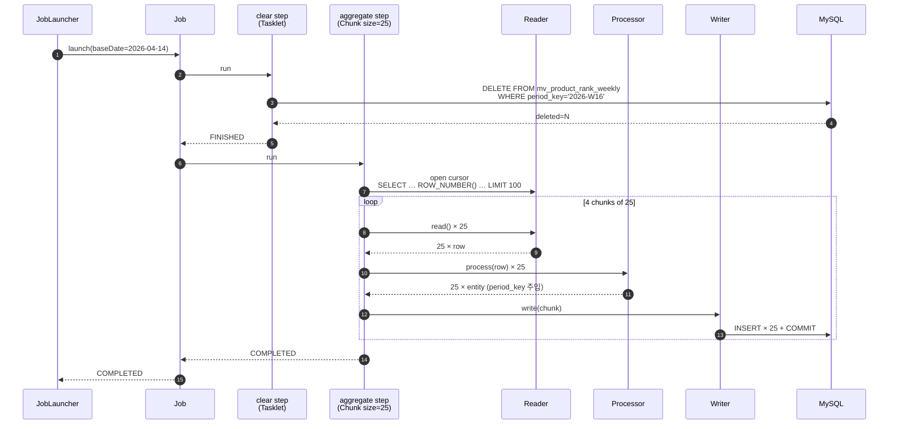
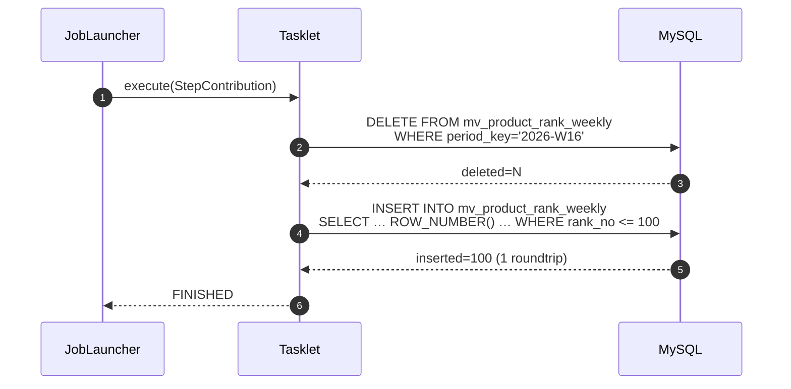

# 무엇을 설명하는가

대규모 데이터의 산출물(주간 랭킹 TOP-100 적재) 을 만드는 두 가지 Spring Batch Step 작성법을 실측으로 비교한다:

- **배치(batch) 라는 처리 모델은 무엇이고, 왜 지금도 살아남았는가**
- **현대 프레임워크에서 배치가 어떤 모양으로 대체 / 보완되고 있는가**
- **Spring Batch 의 기본 동작 원리** — Job / Step / 메타테이블이 무엇이고 왜 그렇게 설계되었는가
- **Chunk-Oriented Processing** — 데이터를 청크 단위로 잘게 끊어 read → process → write 를 도는 방식
- **Tasklet** — `execute()` 한 번으로 끝나는 단일 작업 단위 방식
- **두 변형의 운영성 비교 + wall-time 실측** — 1k → 300k 시드에서 어떻게 다르고, 왜 격차가 수렴하는가


# 왜 작성하는가

<div align="center">
    
</div>

Spring Batch 에는 대규모 데이터 처리(TOP-100 적재) 를 만드는 두 가지 길이 있다.<br />
하나는 **JVM 이 데이터를 청크 단위로 끊어가며 read → process → write 를 도는 길**, 다른 하나는 **DB 에게 SQL 한 발로 통째로 시키는 길**.

처음에는 "어차피 같은 결과면 빠른 쪽 쓰면 되는 거 아닌가?" 싶다. 그런데 **Tasklet 이 wall-time 만 따지면 늘 빠른데도** 실무 배치는 대체로 Chunk-Oriented 로 짠다. 왜?

> 이전 글 — [줄 서야겠지, 서버 살려야겠지](20260402_throttling.md) — 에서 다룬 큐 기반 스로틀링이 "유저 트래픽을 받는 시점의 안정성" 이었다면, 이번 글의 배치는 **"받아둔 데이터를 정해진 주기에 한꺼번에 가공하는 시점의 안정성"** 에 대한 이야기다.

이 글은 두 변형을 같은 산출물(주간 랭킹) 위에서 직접 구현하고 1k / 5k / 10k / 100k / 300k 시드로 실측한 결과 위에서 풀어쓴다.<br />
**"빠르다"** 가 **"좋다"** 와 같지 않은 이유, 그리고 같다고 착각하기 쉬운 그 미묘한 지점들을 정리한다.


<div align="center">
    
    <p><em>미안하다 이거 보여주려고 어그로끌었다.. Tasklet Batch 싸움수준 ㄹㅇ실화냐?</em></p>
</div>

---

# 서론

## 배치(batch) 란 무엇인가

배치는 "**누적된 데이터를 정해진 주기에 한꺼번에 가공하는 처리 모델**" 이다. 어원 그대로, 한 묶음(batch) 으로 모아서 처리한다는 뜻.

서비스가 받는 데이터는 크게 두 가지 모양으로 나뉜다.

- **온라인 (online)**: 유저 요청에 즉시 응답. 한 건씩 처리하고 끝. — 회원가입, 결제, 좋아요.
- **오프라인 (offline / batch)**: 정해진 주기마다 누적된 데이터를 한꺼번에 가공. — 일일 정산, 주간 랭킹 집계, 통계 리포트.

```
온라인:  요청 ──> 처리 ──> 응답  (한 건, 즉시)
배치:    [수십만 건] ──> 정렬·집계·적재 ──> [결과 N 건]  (주기적, 일괄)
```

역사적으로 배치는 컴퓨팅 비용이 비쌌던 시절에 **"비싼 자원을 한꺼번에 몰아 쓰자"** 는 동기로 탄생했다. 메인프레임 시대의 야간 배치, 은행의 일일 마감 정산, 통신사의 월간 정산이 모두 이 모양이다. **CPU 와 IO 를 한 번에 끌어모아 쓰는 게 자원 효율적** 이었기 때문.

지금은 컴퓨팅 자원이 충분히 싸졌지만, 배치가 사라지지는 않았다. 이유는 **자원 효율 외에도 배치가 가진 본질적 강점들이 있기 때문**.

1. **재현성** — 같은 입력으로 두 번 돌리면 같은 결과. 멱등성과 디버깅 가능성이 보장됨.
2. **자원 격리** — 무거운 집계가 온라인 트래픽과 같은 시점에 같은 DB 를 안 친다.
3. **정합성 보장** — "어제 24시 기준 누적 합" 같이 시점이 명확한 결과를 만든다.
4. **운영 단순성** — cron 한 줄로 스케줄, 실패하면 재실행, 결과는 테이블 한 장.

## 그럼 현대에는 배치 대신 무엇을 쓸 수 있는가

배치의 자리를 노리는 현대적 대안들은 여럿 있다. 각자 강점도 있고 한계도 있다.

| 대안 | 핵심 아이디어 | 강점 | 한계 |
|---|---|---|---|
| **Streaming (Kafka Streams, Flink)** | 이벤트 발생 즉시 누적 갱신 | 수 초 latency, near-real-time 집계 | 정확성 보장이 까다로움 (exactly-once, late event, watermark), 운영 복잡 |
| **CDC (Debezium 등) + Materialized View** | DB 변경 로그를 스트림으로 받아 derived table 갱신 | 원본 DB 부하 없이 read-side 분리 | 인프라 추가, 스키마 변경 전파 비용 |
| **Serverless (Lambda + EventBridge / Cloud Scheduler)** | 트리거 기반 함수 실행 | 인프라 관리 거의 0, 비용 사용량 비례 | cold start, 장시간 작업 부적합 (15분 limit 등) |
| **OLAP DB 의 Materialized View 자동 refresh** | DB 가 직접 derived view 를 갱신 | 별도 코드 거의 없음 | DB 종속, refresh 정책 제한적 |
| **Incremental processing (dbt 등)** | 마지막 처리 시점 이후 변경분만 재계산 | 큰 데이터셋에서 비용 절감 | 모델링·테스트 인프라 별도 필요 |

이들 중 우리 도메인 (커머스 랭킹) 에 가장 가까운 후보는 **streaming** 이다. 실제로 일간 (DAILY) 랭킹은 이미 streaming 구조 — Kafka 이벤트가 들어올 때마다 Redis ZSET 에 `ZINCRBY` 하는 방식 — 로 동작하고 있다.

그런데 주간/월간 랭킹은 **streaming 으로 가지 않고 배치를 선택** 했다. 이유:

1. **누적 합의 정확성** — "이번 주 월요일 00시부터 지금까지의 합" 을 streaming 으로 유지하려면 late event / 중복 / drift 추적이 만만치 않다.
2. **재계산 비용** — 가중치 공식이 바뀌면 streaming 은 모든 이벤트 replay 가 필요. 배치는 baseDate 만 다시 던지면 끝.
3. **장기 보관** — Redis ZSET 은 TTL 후 소실. 배치 결과는 RDB 테이블에 영구 보관되어 임의 시점 조회 가능.
4. **운영 단순성** — 주간/월간은 latency 가 수 초일 필요가 없다. cron 한 번 도는 게 압도적으로 단순.

> **요약**: 배치는 "자원 효율" 의 시대에 태어났지만, 지금은 "**재현성 + 정합성 + 운영 단순성**" 으로 살아남는다. streaming 이 배치를 모두 대체하지 못하는 건 이 세 가지 때문.

이 지점을 인정하고 나면, 그 다음 질문은 **"그럼 배치를 어떻게 짤 것인가"** 다. 그게 Spring Batch 가 답하는 영역.

## Spring Batch 가 주는 것

배치 작업 자체는 직접 짤 수 있다. 그런데 직접 짜다 보면 깨닫는다 — **코드의 90% 가 본질이 아닌 인프라 코드** 가 된다.

- "어디까지 처리했는지 기록하기"
- "재시작 시 그 지점부터 이어가기"
- "실패한 청크만 재시도하고 계속 가기"
- "지금 어디까지 갔는지 운영자에게 보여주기"
- "같은 파라미터로 두 번 실행되는 걸 막기"

Spring Batch 는 이 모두를 **메타테이블 5개** 로 표준화해서 책임진다.

<div align="center">
    
</div>

| 테이블 | 책임 |
|---|---|
| `BATCH_JOB_INSTANCE` | "어떤 Job 을 어떤 파라미터로 돌렸는가" — `job_name + job_key(파라미터 해시)` 로 unique |
| `BATCH_JOB_EXECUTION` | "그 instance 가 N번 실행될 수 있다" — 매 실행마다 row 1개, status/start_time/end_time |
| `BATCH_STEP_EXECUTION` | "각 step 의 진행 상황과 카운트" — read_count / write_count / commit_count / rollback_count |
| `BATCH_JOB_EXECUTION_CONTEXT` | Job 레벨의 중간 상태 (key-value blob) |
| `BATCH_STEP_EXECUTION_CONTEXT` | Step 레벨의 중간 상태 — Reader 의 마지막 위치 등 재시작 정보가 여기 들어감 |

**이게 왜 중요한가?**

- 같은 `(job_name, params)` 로 두 번 launch 하면 `JobInstanceAlreadyCompleteException` 이 터진다 — Spring Batch 가 알아서 중복 실행을 막아준다.
- Job 이 STARTED 상태로 죽으면 다음 실행에서 그 instance 를 이어받아 STEP_EXECUTION_CONTEXT 의 마지막 read 위치부터 재개한다 — Spring Batch 가 알아서 회복한다.
- 운영자는 어떤 step 의 어떤 chunk 에서 멎었는지 SQL 한 줄로 본다 — `SELECT * FROM BATCH_STEP_EXECUTION WHERE status='FAILED'`.

## Job 안에 무엇이 있는가 — Step

Job 은 **하나 이상의 Step** 으로 구성된다. Step 은 **실제 일을 하는 단위** 다.

Spring Batch 에서 Step 을 작성하는 방법은 정확히 두 가지 — **Chunk-Oriented Processing** 과 **Tasklet** — 이며, 이 글의 핵심 비교 대상이다.

```
Job
 └─ Step 1 (Tasklet 또는 Chunk)
 └─ Step 2 (Tasklet 또는 Chunk)
 └─ Step 3 (...)
```

같은 Job 안에 두 방식의 step 을 섞을 수 있다. 실제로 우리가 비교할 예시도 한쪽은 두 step (Tasklet → Chunk), 다른 쪽은 한 step (Tasklet) 의 구성이다.

---

# 본론

## 시나리오: 비교 대상이 될 예제 — 주간 랭킹 TOP-100 적재

본격적인 비교에 앞서, 두 변형이 만들 산출물이 무엇인지 그림을 잡아 두자.

**입력**: `product_metrics` 라는 누적 카운터 테이블. 모든 상품에 대해 view / like / sales 카운트가 쌓여 있다.

```
product_metrics
┌────────────┬────────────┬────────────┬─────────────┬──────────────┐
│ product_id │ view_count │ like_count │ sales_count │ sales_amount │
├────────────┼────────────┼────────────┼─────────────┼──────────────┤
│       1001 │       4523 │        128 │          12 │       430000 │
│       1002 │       1234 │         34 │           3 │        90000 │
│       1003 │      12090 │        892 │         203 │      8120000 │
│        ...                                                        │
└────────────┴────────────┴────────────┴─────────────┴──────────────┘
                          (수천 ~ 수십만 row)
```

**출력**: `mv_product_rank_weekly` 라는 derived 테이블. 한 주(예: `period_key='2026-W16'`) 의 TOP 100 상품을 점수 내림차순으로 적재.

```
mv_product_rank_weekly  (period_key='2026-W16' 기준 정확히 100 row)
┌───────────┬────────────┬─────────┬─────────────────┐
│ rank_no   │ product_id │  score  │   period_key    │
├───────────┼────────────┼─────────┼─────────────────┤
│         1 │       1003 │ 9217.32 │  2026-W16       │
│         2 │       2814 │ 8045.10 │  2026-W16       │
│         3 │       1027 │ 7902.55 │  2026-W16       │
│         ...                                        │
│       100 │       4521 │ 1098.60 │  2026-W16       │
└───────────┴────────────┴─────────┴─────────────────┘
```

**가공 로직**:

1. 같은 `period_key` 의 기존 row 가 있으면 모두 DELETE (재실행 시 idempotent 보장)
2. `product_metrics` 의 모든 row 에 대해 점수 계산:
   `score = view_count * 0.1 + like_count * 0.5 + sales_count * 1.0 + sales_amount * 0.001`
3. score 내림차순 정렬, 동점은 product_id 오름차순으로 tie-break, 1~100 등 부여
4. TOP 100 만 INSERT

이 작업을 두 가지 방식으로 구현해 비교한다:

- **Chunk 방식**: 2-step (clear → aggregate). aggregate step 이 Reader/Processor/Writer 파이프라인을 25개씩 4번 돈다.
- **Tasklet 방식**: 1-step. 한 메서드 안에서 DELETE 한 번 + INSERT…SELECT 한 번으로 끝.


## 1. Step 작성법 ① — Chunk-Oriented Processing

Chunk-Oriented Step 의 골격은 정해져 있다. **Reader → Processor → Writer** 의 3단계 파이프라인을 **chunk 크기만큼 반복** 한다.

```
[Reader]                   [Processor]            [Writer]
read() ──┐                                            │
read() ──┼─→ chunk 25건 ─→ process × 25 ──→ write × 25 + COMMIT
read() ──┘                                            │
                                                      ▼
                                               (다음 chunk)
read() ──┐
read() ──┼─→ chunk 25건 ─→ process × 25 ──→ write × 25 + COMMIT
read() ──┘
        ...
```

각 컴포넌트의 책임:

- **Reader** — 데이터를 한 건씩 읽어 들인다. JDBC 커서를 열어 SQL 결과를 한 행씩, 또는 파일을 한 줄씩, 메시지 큐에서 메시지 한 개씩.
- **Processor** — 읽은 한 건을 다음 단계가 쓸 수 있는 모양으로 변환한다. 필터링도 여기서 — `null` 을 반환하면 그 건은 write 대상에서 제외된다.
- **Writer** — chunk 단위로 모인 결과를 한꺼번에 쓴다. JPA 에 저장, JDBC batch insert, 파일에 append 등.

**핵심 특성:**

- **Chunk 단위 트랜잭션**: 25건이 모이면 한 트랜잭션으로 묶어 commit. 실패하면 그 청크만 롤백.
- **회복 가능**: chunk 25에서 실패해도 chunk 1~24 까지의 commit 은 살아 있고, 재시작 시 reader 가 그 지점부터 다시 연다.
- **메모리 일정**: chunk size 만큼만 메모리에 들고 있음. 100만 건이어도 OOM 위험이 없다.
- **Step metrics 자동 수집**: `read_count`, `write_count`, `commit_count`, `rollback_count` 가 메타테이블에 자동 기록.

### 우리 예시에서의 Chunk 구성

주간 랭킹 작업을 Chunk 방식으로 짜면 자연스럽게 **2-step** 이 된다.

**Step 1 — clear** (Tasklet 으로 작성)
- "같은 `period_key` 의 기존 row 를 DELETE" 한 번. 이건 chunk 로 쪼갤 게 없는 단순 작업이라 Tasklet 으로.

**Step 2 — aggregate** (진짜 Chunk)
- **Reader**: `product_metrics` 에서 점수 계산 + 정렬 + 1~100등 번호 매김 + 100건만 cut 한 결과를 한 행씩 읽음. SQL 한 발로 표현하면:
  ```sql
  SELECT product_id,
         (view_count*0.1 + like_count*0.5 + sales_count*1.0 + sales_amount*0.001) AS score,
         ROW_NUMBER() OVER (
             ORDER BY (view_count*0.1 + like_count*0.5 + sales_count*1.0 + sales_amount*0.001) DESC,
                      product_id ASC
         ) AS rank_no,
         view_count, like_count, sales_count, sales_amount
  FROM product_metrics
  ORDER BY (view_count*0.1 + like_count*0.5 + sales_count*1.0 + sales_amount*0.001) DESC, product_id ASC
  LIMIT 100
  ```
- **Processor**: 읽어온 한 행을 적재용 엔티티로 변환하면서 `period_key='2026-W16'` 을 주입.
- **Writer**: JPA 로 INSERT.

**왜 SQL 에서 `ROW_NUMBER()` 로 rank 를 부여했는가?**<br />
Processor 에서 `AtomicInteger` 같은 카운터를 돌리면 chunk retry 시 중복 rank 가 생긴다. DB-side 에서 부여하면 reader 가 다시 열려도 결정적이고, **tie-break (`product_id ASC`) 까지 SQL 한 곳에 고정** 되어 JVM 비교 로직과의 drift 가 0 이다.

전체 흐름은 다음과 같다.




## 2. Step 작성법 ② — Tasklet

Tasklet 의 골격은 훨씬 단순하다. **`execute()` 한 번이면 끝**.

`Tasklet` 인터페이스는 단 하나의 메서드를 가진다.

```
execute(contribution, ctx) → RepeatStatus
```

`RepeatStatus.FINISHED` 를 반환하면 step 종료, `CONTINUABLE` 를 반환하면 다시 호출된다 (드물게 사용).

**핵심 특성:**

- **단일 트랜잭션**: step 시작부터 끝까지 한 트랜잭션. 실패 시 step 전체 롤백, 재시작 시 처음부터.
- **자유로움**: read/process/write 의 강제된 구조가 없음. 안에서 무엇을 하든 자유.
- **회복 단위 = step 전체**: chunk-level retry 라는 게 없다. step 전체를 다시 돌리는 수밖에.

### 우리 예시에서의 Tasklet 구성

같은 주간 랭킹 작업을 Tasklet 으로 짜면 step 이 **단 1개** 다. 그 안에서 두 SQL 을 차례로 던진다.

**SQL ① DELETE** — 같은 period_key 의 기존 row 정리
```sql
DELETE FROM mv_product_rank_weekly WHERE period_key = '2026-W16'
```

**SQL ② INSERT … SELECT** — 점수 계산 + 정렬 + 번호 매김 + TOP 100 cut + 적재를 한 발로
```sql
INSERT INTO mv_product_rank_weekly
    (product_id, rank_no, score, view_count, like_count, sales_count, sales_amount,
     period_key, created_at, updated_at)
SELECT t.product_id, t.rank_no, t.score,
       t.view_count, t.like_count, t.sales_count, t.sales_amount,
       '2026-W16', NOW(6), NOW(6)
FROM (
    SELECT product_id,
           (view_count*0.1 + like_count*0.5 + sales_count*1.0 + sales_amount*0.001) AS score,
           ROW_NUMBER() OVER (
               ORDER BY (view_count*0.1 + like_count*0.5 + sales_count*1.0 + sales_amount*0.001) DESC,
                        product_id ASC
           ) AS rank_no,
           view_count, like_count, sales_count, sales_amount
    FROM product_metrics
) t
WHERE t.rank_no <= 100
```

이게 전부다.

- DELETE 한 번
- INSERT … SELECT 한 번 (정렬·번호매김·top-N cut 까지 DB 가 모두 처리)
- `RepeatStatus.FINISHED` 반환

**Chunk 변형의 Reader/Processor/Writer 분리가 사라지고, JVM 측 객체 매핑이 거의 없다.** 즉, JVM 은 SQL 두 줄을 던지는 역할만 한다.




## 3. 같은 결과, 다른 길

두 변형은 **bit-for-bit 같은 TOP-100 ID 리스트** 를 생성한다 (E2E 테스트로 검증). 그렇다면 차이는 어디에 있는가?

<div align="center">
    
</div>

**핵심은 누가 어디까지 일을 하느냐다.**

| 단계 | Chunk-Oriented | Tasklet |
|---|---|---|
| **데이터 선택 (SELECT)** | DB | DB |
| **점수 계산** | DB | DB |
| **정렬·rank 부여** | DB (ROW_NUMBER + ORDER BY) | DB (ROW_NUMBER + ORDER BY) |
| **JVM 으로 row 전송** | 100 rows × Network roundtrip | **없음** |
| **JVM 객체 매핑** | RowMapper × 100 + Processor × 100 | 없음 |
| **INSERT** | JpaItemWriter × 4 chunks | DB 가 그 자리에서 INSERT |
| **트랜잭션 경계** | Chunk × 4 + Clear × 1 = 총 5번 commit | 단일 1번 commit |

같은 결과를 만들지만 **연산이 일어나는 위치 (DB vs JVM) 와 트랜잭션 경계의 수** 가 다르다. 이게 운영 모델과 wall-time 에 동시에 영향을 준다.

### 운영 모델 비교

| 기준 | Chunk-Oriented | Tasklet |
|---|---|---|
| **회복 단위** | Chunk 단위 (실패 chunk 만 retry / skip 가능) | Step 전체 (단일 TX 라 모 아니면 도) |
| **중간 상태 관측** | step metrics 에 read/write/commit count 가 chunk 단위로 누적 | "실행 중" 외에 진행률을 보기 어려움 |
| **메모리 사용** | chunk size 에 비례 (일정) | DB 가 처리하므로 JVM 측은 거의 0 |
| **DB 락 보유 시간** | chunk 단위로 짧게 끊김 | step 전체가 한 트랜잭션 — 데이터셋 클수록 길어짐 |
| **코드 구조** | Reader/Processor/Writer 분리 — 책임이 명확 | SQL 한 덩어리 — 단순하지만 비즈니스 로직이 SQL 안으로 들어감 |
| **테스트성** | 각 컴포넌트를 독립 테스트 가능 | SQL 의존성이 강해 통합 테스트가 사실상 강제됨 |
| **확장성** | skip/retry policy, async/parallel chunk 등 Spring Batch 확장 지점 풍부 | 기능 확장 = SQL 재작성 |

가장 큰 차이는 **회복 모델**. 운영 환경에서 DB connection drop / OOM / lock timeout 같은 일시적 실패가 났을 때 — Chunk 변형은 "1만 건 처리했는데 1.025만 건째에서 실패 → 1.025만 건째부터 다시" 가 가능하지만, Tasklet 은 **"실패 → 처음부터 모든 걸 다시"** 가 강제된다.

### 그러면 왜 Tasklet 도 쓰는가?

1. **단순한 작업** (DELETE 한 번, FILE 하나 옮기기, SHELL 한 번 실행 등) — Reader/Processor/Writer 의 강제된 구조가 오히려 거추장스러움.
2. **DB 가 모두 할 수 있는 단일 SQL 작업** — 네트워크 roundtrip 을 줄이고 DB 의 옵티마이저에 모든 걸 맡기는 게 압도적으로 빠를 때.
3. **"이건 한 트랜잭션으로 묶여야 한다"** 는 강한 제약 — chunk 로 쪼개면 부분 적용 위험이 있는 작업.

우리 예시의 `clear step` 도 사실 Tasklet 이다 — "DELETE WHERE period_key=?" 하나뿐이라 굳이 chunk 구조를 강제할 이유가 없다. **Job 안에서 작업의 성격에 따라 두 방식을 자유롭게 섞는 게 정석.**


## 4. 실측 — Wall time 비교

이제 가장 궁금한 질문. **실제로 얼마나 차이 날까?**

### 측정 환경

- **Host**: macOS (Darwin 25.3.0), JVM 21.0.10
- **DB**: TestContainers MySQL 8.0 (local Docker)
- **TOP_N**: 100
- **Chunk size**: 25 (→ 4 chunks)
- **Seed**: `product_metrics` 에 1k / 5k / 10k / 100k / 300k 행을 결정적 random 으로 삽입
- **Wall time**: Job launch 호출 전후 `System.nanoTime()` (Job launch 만, seed 시간 제외)
- **Sample**: 각 seed 1회 측정 (JIT noise 있음)

### Wall time 표

| Seed | Chunk (ms) | Tasklet (ms) | Tasklet 우위 |
|------:|-----------:|-------------:|:-----------:|
| 1,000   | 171 | 34  | **5.0×** |
| 5,000   | 140 | 37  | **3.8×** |
| 10,000  | 103 | 42  | **2.5×** |
| 100,000 | 206 | 143 | **1.4×** |
| 300,000 | 579 | 501 | **1.16×** |

### 그래프

<div align="center">
    
</div>

위 차트의 핵심 발견:

1. **Tasklet 은 모든 구간에서 Chunk 보다 빠르다** — 이건 예상대로.
2. 그런데 **격차가 데이터셋이 커질수록 빠르게 수렴** 한다 — 1k 에서 5× → 10k 에서 2.5× → 100k 에서 1.4× → 300k 에서 1.16×.
3. **Chunk 의 1k~10k 구간은 오히려 wall time 이 줄어드는 것처럼 보인다** — JIT/cache warm-up 비용이 dominant 한 탓. 100k 부터 본격적인 비례 증가.

### 왜 격차가 수렴하는가

Tasklet 은 **"DB 가 정렬·번호매김·삽입을 통째로 한다"** 는 점에서 빠르다. 그런데 데이터셋이 커지면 **이 정렬 비용이 데이터셋 크기에 직접 비례** 한다.

```
Tasklet 의 wall time 곡선:
  1k  →  300k 에서 ×14.7 (가파름)

Chunk 의 wall time 곡선:
  1k  →  300k 에서 ×3.4  (완만함, JIT warm-up 효과 포함)
```

Chunk 는 base cost (Reader 열고 Processor/Writer 파이프라인 세팅) 가 크지만, 그 이후의 추가 비용은 chunk 단위로 분산된다. Tasklet 은 base cost 가 거의 0 이지만 **모든 비용이 단일 SQL 의 정렬·번호매김 비용으로 응축** 된다.

수백만 row + score 컬럼에 인덱스 부재 환경이라면 **filesort 가 dominant 해지면서 Tasklet 이 Chunk 를 추월할 가능성** 이 충분히 있다. 실제로 격차가 이미 1.16× 까지 좁아진 300k 구간이 그 신호.

### 두 변형 모두 sub-second 인 이유

300k 시드에서도 두 변형 모두 600ms 미만. 이는 다음 두 조건 덕분:

1. **TOP_N=100 으로 결과 cardinality 가 고정** — 입력이 30만이어도 출력은 100건.
2. **MySQL 이 LIMIT push-down + filesort 를 잘 처리** — `ORDER BY ... LIMIT 100` 을 priority queue 로 최적화.

만약 결과 cardinality 도 데이터셋과 함께 커지는 작업 (예: 전체 row 를 그대로 적재) 이라면 절대값과 격차 모두 다른 양상이 나올 것이다.


## 5. 정합성 — 두 변형이 "정말로" 같은 결과를 만드는가

성능 비교는 **두 변형이 같은 결과를 만든다는 전제** 위에서만 의미가 있다. 그래서 다음을 보장했다:

### 단일 score 공식

두 변형 모두 score 표현식을 단일 상수로 묶어 사용한다.

```
score = view_count * 0.1
      + like_count * 0.5
      + sales_count * 1.0
      + sales_amount * 0.001
```

이 표현이 SQL 안에 박혀 있고, Chunk 변형의 Reader 와 Tasklet 변형의 INSERT 둘 다 같은 문자열을 참조한다. 한쪽만 바뀌면 코드 리뷰에서 즉시 보인다.

### Tie-break 도 SQL 한 곳에

```sql
ROW_NUMBER() OVER (ORDER BY <score 표현> DESC, product_id ASC)
```

같은 점수의 row 들도 `product_id ASC` 로 결정적 순서가 부여된다. JVM 측에서 비교 로직을 다시 짤 일이 없다 — 짤 일이 없으면 drift 도 없다.

### Floating-point drift 의 함정

```
JVM Double:   1098.5999999999999
MySQL Double: 1098.6000000000001
```

같은 공식이라도 reduction order (가산 순서) 가 다르면 ULP 레벨 차이가 발생한다. 검증 테스트는 정확 일치 대신 작은 허용오차 (1e-9) 로 흡수했다.

이건 Tasklet 에 한정된 이야기가 아니라, **DB 와 JVM 사이의 floating-point 비교 일반의 함정**. Spring Batch 와 직접 관련은 없지만, 같은 산출물을 두 경로로 만들 때 반드시 마주치게 되는 이슈다.

---

# 결론

> **같은 결과를 만드는 두 변형의 비용이 같지 않다.** 그리고 "비용" 은 wall-time 만이 아니다.

이번 글의 실측에서 발견한 것을 한 줄로 요약하면:

> **Tasklet 은 늘 빠르지만, 그 격차는 데이터셋이 커질수록 빠르게 수렴한다. 그리고 wall-time 이 같다면 Chunk 가 운영성에서 우위다.**

## 무엇을 골라야 하는가

| 상황 | 추천 |
|---|---|
| DELETE 한 번, FILE 옮기기, 단순 SQL 한 발 | **Tasklet** — 강제된 구조가 오히려 부담 |
| 결과 cardinality 가 작고 (TOP-N), 데이터셋도 작은 (~10k) 단발 작업 | **Tasklet** — 5× 차이는 실질적 |
| 수십만~수백만 row 처리, 운영 환경에서 안정성·관측성 필요 | **Chunk** — 격차는 거의 없는데 회복 모델 + step metrics 의 가치가 크다 |
| Job 안에서 단계별 책임이 다른 작업 (예: clear → aggregate → notify) | **두 방식을 같은 Job 안에 섞기** — clear 는 Tasklet, aggregate 는 Chunk |
| 중간 진행률·재시작·skip/retry 가 운영 SLA 에 들어감 | **Chunk** — Spring Batch 의 기본 확장 지점이 모두 chunk 위에 있다 |

## 한 가지 더 — 측정해 본 것의 무게

처음 두 변형을 구현할 때는 "Tasklet 이 그냥 압도적으로 빠르겠지" 라고 추측했다. 1k 시드에서 5× 차이를 보고는 그 추측이 맞다고 생각했다.<br />
그런데 100k / 300k 까지 늘려서 실측해 보고 나서야 **"격차가 수렴한다"** 는 사실이 보였다. 그리고 그 수렴이 보이고 나니, "그러면 운영성이 우월한 Chunk 가 더 합리적인 선택이 되는 임계점이 있다" 는 결론이 자연스럽게 따라왔다.

추측은 늘 우아하지만, 실측은 가끔 추측의 결론을 뒤집는다. 그게 벤치마크의 가치다.

## 그리고 — Spring Batch 자체도 silver bullet 이 아니다

이 글은 "주간 랭킹 TOP-100 적재" 라는 **하나의 구체적 시나리오** 에서 Spring Batch 의 두 변형을 비교했다. <br />
그러나 이건 **bulk data 를 가공하는 여러 길 중 하나일 뿐** 이다.

같은 산출물을 만드는 다른 길이 충분히 있다:

- **Streaming (Kafka Streams / Flink)** — 이벤트가 들어올 때마다 누적 갱신해서 배치 자체를 없앨 수 있다. 단, late event / 정확성 보장 / 운영 복잡도가 트레이드오프.
- **CDC + Materialized View** — 원본 DB 의 변경을 스트림으로 받아 derived table 을 자동 갱신. 인프라 부담을 가져온다.
- **OLAP DB 의 자동 refresh MV** — Snowflake / BigQuery / Postgres 의 MV 기능에 맡기면 코드가 거의 없다. DB 종속과 refresh 정책 제한이 트레이드오프.
- **Serverless 스케줄 함수** — Lambda + EventBridge 로 짧은 작업을 인프라 없이 굴린다. cold start 와 시간 제한이 트레이드오프.
- **dbt 같은 incremental processing 프레임워크** — 변경분만 다시 계산. 데이터 모델링 인프라가 별도로 필요하다.

각자 강점도 한계도 다르다. **"우리 도메인의 SLA, 데이터 크기, 정확성 요구, 운영 인력의 익숙함"** 을 종합하여 전략을 선택하자.

> 명심하자. 어떤 기술도 silver bullet 은 없다.<br />
> **항상 트레이드오프이고, 정확하게 비교한 다음에 골라야 한다.**<br />
> 그 비교는 실측을 통과해야 비로소 완성된다. <br />
> 모든 선택에는 증명과 트레이드오프의 연속이다!
